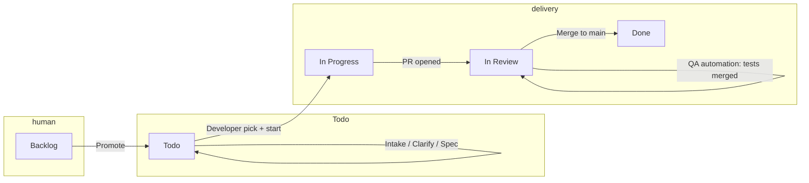

# Ship — delivery, quality, and release process (portable playbook)

This document describes a **complete, project-agnostic** operating model for teams using **Ship**: tracker states, human vs automation boundaries, **QA** vs **QA automation**, regression as a **promote gate**, optional **scheduled production release**, and **mandatory daily rhythm** (morning digest + end-of-day retro email). Use it when adopting Ship into **any** repository—not only a specific product or hosting stack.

**Companion docs:** [Getting started](../getting-started/index.md) (commands and agent bundle), [Agent playbook](agent-playbook.md) (wiring Ship into the tree), [Tools catalog](/tools) (tracker / CI / agent / secret adapters), [The book](../framework/index.md) (philosophy and long narrative).

---

## 1. Goals

1. **Single system of record** for “what is promised” (tracker) and **machine-checkable fences** (project, state, labels, CI).
2. **Clear separation:** humans own intent at thresholds; automation owns repeatable, boring steps inside explicit rules.
3. **Two-layer quality:** **QA** validates the fix/feature against intent; **QA automation** encodes that validation as **automated tests** that run on a **shared environment** (e.g. staging/dev) and later act as **go/no-go** for production promotion.
4. **Safe CD:** promote to production only when **defined signals** are green (tests, artifact identity, optional human approval).
5. **Daily visibility:** once per calendar day, a **morning digest** summarises what moved in the last ~24 hours; once per calendar day, a **retro agent** reviews the day’s signals and emails **actionable improvement recommendations**. Recipients are **always** configured by the organisation (we recommend a **mailing list / DL**, not a single person’s inbox).

---

## 2. Naming and placeholders

Parameterize for your org (agent or human fills these once per adoption):

| Placeholder | Meaning |
|-------------|---------|
| `{SHIP_ROOT}` | Directory containing Ship `documentation/` and `prompts/` (e.g. `tools/ship`). |
| `{TRACKER}` | Linear, Jira, GitHub Issues, Azure Boards, ClickUp, spreadsheet, or custom tracker. |
| `{DELIVERY_PROJECT}` | Tracker project (or equivalent) for the **delivery lane** only. |
| `{STAGING_ENV}` | Hosted pre-production URL or environment name (often “dev” or “staging”). |
| `{PROD_ENV}` | Production URL or environment name. |
| `{MAIN_BRANCH}` | Default integration branch (usually `main`). |
| `{REGRESSION_WORKFLOW}` | CI workflow that runs the **full** automated regression against `{STAGING_ENV}`. |
| `{DAILY_DIGEST_EMAIL}` | **Required** for the morning digest: one or more addresses (comma-separated). **Recommendation:** use a **distribution list (DL)** / Google Group / team alias so ownership survives holidays and handovers. |
| `{DAILY_RETRO_EMAIL}` | **Required** for the end-of-day retro: where the agent sends improvement recommendations. May be the **same DL** as `{DAILY_DIGEST_EMAIL}` or a separate leadership/tech-leads list—your policy. |

**Secrets / provider:** implement with your mail stack (e.g. SendGrid, SES, SMTP). Store API keys in GitHub Actions secrets or the agent runtime; **never** hard-code addresses in prompts—inject `{DAILY_DIGEST_EMAIL}` / `{DAILY_RETRO_EMAIL}` from environment or repository variables.

---

## 3. Core principles

### 3.1 Tracker as API

Treat **project**, **state/column**, and **labels** like an API schema. Automation must **fail closed** when the schema does not match (wrong state name, missing label). Rename states in the tracker only with a **documented migration** and script updates.

### 3.2 Fences (X / Y / Z)

- **X — Which backlog?** Only issues in `{DELIVERY_PROJECT}` (or your agreed filter) participate in the automated SDLC lane.
- **Y — Which state?** Each job may touch only issues in allowed states (e.g. automation does not pick from **Backlog** if your policy is human-only there).
- **Z — Which labels?** Gates use a **small, fixed** label vocabulary (`ready:*`, `stage:*`, `qa:*`, `result:*`, etc.). Typos are bugs.

### 3.3 One branch contract per ticket

Enforce a **single canonical branch pattern** per issue (e.g. `fix/{ISSUE}-auto`) so you do not get duplicate PRs and split truth.

---

## 4. Recommended tracker columns (delivery board)

Align names with your tracker; Ship’s reference config uses six columns:

| # | State | Type | Purpose |
|---|--------|------|---------|
| 1 | **Backlog** | pre-work | Human triage; **no** automated SDLC pick (recommended). |
| 2 | **Todo** | queue | Intake, clarification, spec, and **queued** implementation; automation picks from here per role rules. |
| 3 | **In Progress** | active | Implementation on a branch; typically one active dev pick per issue. |
| 4 | **In Review** | validation | Open PR, preview deploy, **human QA**, optional **QA automation** PR for tests. |
| 5 | **Done** | terminal | Shipped per your definition (merged to `{MAIN_BRANCH}`, deployed, or explicitly accepted). |
| 6 | **Blocked** | hold | Stop; requires explicit unblock. |

**Canonical queue column name:** **Todo** (must exist in the tracker under this exact name for CLI handoffs and pick scripts to match).

---

## 5. Label contract (minimal + QA split)

Start small; extend only when a script reads the label.

### 5.1 Routing and stage (examples)

| Prefix | Examples | Meaning |
|--------|-----------|---------|
| `stage:*` | `stage:intake`, `stage:developer`, `stage:qa-automation` | Current lane owner. |
| `ready:*` | `ready:developer`, `ready:qa-automation` | Eligible for **pick** by that role’s automation. |
| `result:*` | `result:failed`, `result:blocked` | Outcome / stop signals. |

### 5.2 QA vs QA automation (recommended addition)

| Label | Set by | Meaning |
|-------|--------|---------|
| `qa:verified` (or team-specific) | **Human QA** | The fix/feature matches AC and risk assessment for this ticket; safe to encode in automation. |
| `ready:qa-automation` | Process / QA lead | Work may be **picked** by QA automation (add/update automated tests). |

**Rule:** do not set `ready:qa-automation` until **`qa:verified`** (or equivalent human signal) is present—otherwise tests are written against unapproved behaviour.

Optional: `ready:human` for explicit “ready for final human sign-off before merge” if your flow needs it.

### 5.3 Stop / pause labels for developer pick

Typical exclusions from automated developer pick (adjust in `pick-next-dev-issue.mjs` or equivalent):

- `human:review-required` — pause automation until a human clears it.
- `auto:failed` — last automation run failed; needs triage.
- `result:blocked` — explicit block.

---

## 6. End-to-end flow (happy path)

### 6.1 Human: Backlog → Todo

- Issue is understood enough to enter the delivery lane and lives in `{DELIVERY_PROJECT}`.

### 6.2 Automation: intake → clarification → spec (optional roles)

- **Intake:** normalize description, classify; either ask questions (**stay in Todo**) or mark ready for spec (**still Todo**).
- **Clarification:** follow up on open questions; when resolved, return to spec path (**Todo**).
- **Spec / BA:** add AC, scope, test notes; when ready, set **`ready:developer`** (**Todo**).

*Cron or event grid is yours; Ship reference uses scheduled roles—replicate with one role per time slot to avoid stampedes.*

### 6.3 Developer

- Pick: **Todo** + **`ready:developer`** + not blocked by pause labels.
- **`start`:** move to **In Progress**, set `stage:developer`, create/use canonical branch.
- Implement, run local/project CI commands, open **one** PR; link ticket; move tracker to **In Review** when PR is ready for review.

### 6.4 Release / preview gate (CI)

- PR checks + preview deploy (if applicable).
- **`release-check`** (or equivalent): if checks fail → comment, labels, return work to developer queue (**Todo**) with `result:failed`; if preview not ready → wait and retry.

**Modes:**

- **Strict:** after green checks + live preview, hand off to **QA automation queue** (`ready:qa-automation`) only **after** human QA has verified (`qa:verified`).
- **Fast path (e.g. low risk):** if CI already ran the agreed E2E/smoke on the PR, allow **skip straight to “ready for merge”** in **In Review**—document when this is allowed.

### 6.5 Human QA (validates the fix)

- Verifies AC, edge cases, and risk areas on **preview** or `{STAGING_ENV}`.
- Outcomes: **pass** → set `qa:verified` + optionally `ready:qa-automation`; **fail** → comment, move to **In Progress** (or stay **In Review** with clear defects—pick one policy).

### 6.6 QA automation (encodes validation)

- **Goal:** add or update **automated** tests (e.g. Playwright, API tests) that reflect the **accepted** behaviour—not guesswork before QA.
- Delivers a **PR** (often test-only or test-heavy) to `{MAIN_BRANCH}`; tags tests for **`{REGRESSION_WORKFLOW}`** (e.g. `@regression`, `@release-gate`).
- When tests are merged, **In Review** ticket can proceed to merge of the **product** PR (if not already merged—order depends on whether you require tests in the same PR or a follow-up; **document the rule**).

### 6.7 Merge and deploy to staging

- Merge product change to `{MAIN_BRANCH}`.
- CI deploys to `{STAGING_ENV}` (your existing pipeline).

### 6.8 Regression as integrity + promote gate

- **`{REGRESSION_WORKFLOW}`** runs against `{STAGING_ENV}` on a schedule and/or after deploy.
- **Production promotion** (manual or weekly) is allowed only if:
  - the **artifact** (image digest / git SHA) you promote is the same one that passed regression, or
  - the **latest** staging deploy is green for the **required** test tags—define this precisely to avoid racing ahead of tests.

### 6.9 Production

- **Manual promote** or **scheduled promote** (see §8)—merge to prod is **human-only** unless you explicitly automate merge with strong branch protections.

### 6.10 Done

- Tracker **Done** when your org agrees (e.g. merged + on prod + no open Sev1).

---

## 7. Audit track (separate from delivery)

Architecture / quality / security **audits** should use **separate tracker projects** (or labels) and **must not** consume the delivery pick queue. They produce evidence-backed findings—not speculative tickets.

---

## 8. Automatic / scheduled release (optional)

Use when the team accepts **policy-level** automation for prod.

1. **Workflow:** `schedule` (e.g. weekly) + `workflow_dispatch`.
2. **Inputs:** promote **pinned artifact** (digest or immutable tag), not an ambiguous “latest” unless latest is defined as “last green staging deploy”.
3. **Gates:** last **`{REGRESSION_WORKFLOW}`** success for that artifact; optional Snyk/policy gates.
4. **Safety:** GitHub **Environment** `production` with required reviewers **or** fully automated only after gates are proven stable.
5. **After:** tag/release notes, notify owners, **document rollback** (previous digest / one-click revert).

---

## 9. Daily digest and retrospective (mandatory)

These loops are **not** the delivery SDLC lane and **not** the architecture audit lane. They are a **third rhythm**: short, email-based, so leadership and ICs see motion and get structured improvement hints without opening five tools.

### 9.1 Morning digest (once per day)

| Field | Recommendation |
|-------|----------------|
| **Schedule** | One run per calendar day in the **morning** in your team’s primary timezone (e.g. 08:00 local)—pick a single anchor time and document it. |
| **Agent task** | Summarise **the past ~24 hours** (rolling window ending “now” at job start): merged PRs, notable CI outcomes, deploys to `{STAGING_ENV}`, `{TRACKER}` transitions (e.g. opened / Done / Blocked), incidents or hotfixes, and **open risks** (flaky checks, tickets stuck in **In Review**). |
| **Output** | One email to **`{DAILY_DIGEST_EMAIL}`** with a clear subject line (e.g. `[Ship digest] YYYY-MM-DD`) and bullet sections; link to `{TRACKER}`, key PRs, and failing workflows. **No fabrication:** if nothing material happened, say so in one line. |
| **Recipient** | **User-configured.** **Recommendation:** a **DL** so the digest is not lost when someone is OOO. |

### 9.2 End-of-day retro (once per day)

| Field | Recommendation |
|-------|----------------|
| **Schedule** | One run per calendar day **after** the working day’s activity has mostly landed (e.g. 21:00 local) **or** offset from the digest (digest morning, retro evening)—**not** the same minute as the digest unless you deliberately want one combined job. |
| **Agent task** | **Review the day’s work** using the same sources as §9.1 plus, where available: diff volume, repeated failure patterns, review latency, and **tracker hygiene** (e.g. stale **In Progress**, missing links to PRs). Produce **concrete recommendations**: process tweaks, test gaps, doc updates, automation fences—each item should be **actionable** (who could do it, or “team decision”). |
| **Output** | One email to **`{DAILY_RETRO_EMAIL}`** with subject e.g. `[Ship retro] YYYY-MM-DD — recommendations`. Keep it scannable: top 3–7 bullets, optional “watch list” for the next day. **No fabrication:** if there is nothing to improve beyond routine, say that explicitly. |
| **Recipient** | **User-configured.** **Recommendation:** same **DL** as the digest for transparency, **or** a smaller DL (tech leads + EM) if retro content is more sensitive—document the choice. |

### 9.3 Configuration contract

- **Addresses are never hard-coded** in repo prompts: pass **`{DAILY_DIGEST_EMAIL}`** and **`{DAILY_RETRO_EMAIL}`** from GitHub **Variables** (non-secret) or **Secrets** if your provider requires it, or from the Cursor Cloud Agent environment for that repo.
- **Same DL for both** is valid and reduces drift; splitting digest (wide) vs retro (narrow) is also valid.
- **Idempotency:** each job sends **at most one** email per scheduled run; if the workflow retries, guard with a dated marker in `{TRACKER}` or a workflow artifact so you do not spam the DL.
- **Optional:** post a short copy to a Slack channel **in addition** to email—email remains the **system of record** for async teams.

### 9.4 Implementation note for adopters

Ship does not ship a single canonical “digest” workflow in-tree for every stack: you add **one scheduled GitHub Action** (or Cursor Automation on a schedule) that runs a small script or Cloud Agent with a prompt under `SHIP_ROOT/prompts/cloud-agent/` (e.g. `daily-digest.md`, `daily-retro.md`). The playbook **requires** these behaviours operationally; wiring is product-repo specific.

---

## 10. Adoption checklist (for a local agent)

Use this when “stretching Ship” onto a new repo:

1. **Set placeholders** in §2; write them into the product README or internal doc.
2. **Choose tracker**; document your state/label (or field) mapping and env vars; if APIs are limited, document manual or hybrid fallback.
3. **Create or map** workflow states to §4; queue column must be named **Todo** (same string the CLI uses).
4. **Sync labels** (Linear: `sync-linear-team-labels.mjs`; others: manual or adapter).
5. **Wire GitHub Actions:** checkout `SHIP_ROOT`, run `verify-setup`, then pick → `cloud-agent-launch` (or local agent) with **`prompts/cloud-agent/*.md`**.
6. **Add** `prompts/cloud-agent/` roles you actually run (intake, developer, **qa-automation** if you automate test authoring).
7. **Define** PR + preview + `release-check` policy (strict vs fast path).
8. **Define** human QA step and **`qa:verified` → `ready:qa-automation`** handoff.
9. **Point** `{REGRESSION_WORKFLOW}` at real jobs; tag tests for **release gate**.
10. **Decide** prod promote: manual only vs scheduled; document gates in §8.
11. **Configure §9:** create **`{DAILY_DIGEST_EMAIL}`** and **`{DAILY_RETRO_EMAIL}`** (recommend DLs), wire mail provider secrets, add **two** scheduled workflows (morning digest + end-of-day retro) and prompts with **no-fabrication** rules.
12. **Train** the team: who clears `auto:failed`, who owns weekly release, what “Done” means.

---

## 11. What Ship provides vs what you must add

| Area | Often in Ship package | You must parameterize |
|------|----------------------|------------------------|
| Interface contracts | This document + tracker adaptation contract | State names, label/field mapping, evidence rules |
| Reference prompts | `prompts/cloud-agent/*.md`, `prompts/onboarding/*.md` | Extra roles and org-specific policy |
| Example workflow patterns | Reference implementations | Real YAML in **your** repo |
| Staging/prod mechanics | Not fixed | Your host, registry, promote scripts |
| Daily digest + retro email | Prompt patterns in §9 | Schedules, `{DAILY_DIGEST_EMAIL}`, `{DAILY_RETRO_EMAIL}`, mail provider |

---

## 12. Summary sentence for stakeholders

**Humans** triage and approve intent; **developers** ship changes with one PR per ticket; **QA** confirms the product truth; **QA automation** locks that truth into tests; **CI on staging** proves integrity; **production** moves only when those proofs (and your policy) say go. **Every day**, a **morning digest** and an **end-of-day retro email** keep the team aligned and turning friction into improvements—delivered to the **DLs you configure**, not buried in chat.
