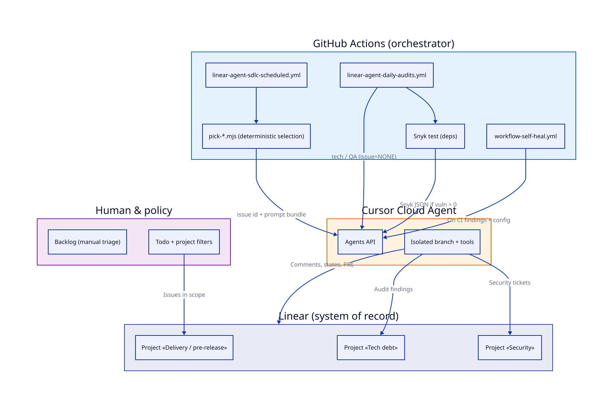

# The book — why Ship

!!! tip "Need commands, not chapters?"
    **Operational checklist** (verify, paths, what to paste into an agent): **[Getting started](../getting-started/index.md)**. This page is the **long narrative** — motivation, trade-offs, and vocabulary — for readers who want the logic before or after wiring.

This page is **Ship** as a **book-shaped essay**: you can read it on a long flight or in **about fifty short sittings** — a **Prologue**, a **Preface**, forty numbered chapters, and a scattered set of lettered sub-chapters that cover artifacts (18.A–D), morning metrics (20.A), prompt evals (22.A), the improvement loop (25.A–C), regulated-vertical overlays (28.A), cost and envelope (31.A), agent PR review (33.A), and onboarding (35.A), followed by a closing **Manifesto** before the **Vocabulary**. Each chapter is one idea — roughly **three to five minutes** of reading at a normal pace — written as a short essay, not a bullet list disguised as wisdom. Underneath the tone, the rules are the same ones we ship in production, and every new passage that was added in the 2026 edition is anchored to a real commit in the reference org; the anchors live in **[Book → Examples map](./examples-plan.md)**.

**Jump (major parts):** [Prologue](#prologue) · [Preface](#preface) · [The idea](#the-idea) · [The system](#the-system) · [Artifacts as work objects](#artifacts-as-work-objects) · [Running the loop](#running-the-loop) · [The improvement loop](#the-improvement-loop) · [Trust & boundaries](#trust-and-boundaries) · [Rolling it out](#rolling-it-out) · [When things break](#when-things-break) · [The Ship Manifesto](#the-ship-manifesto) · [Vocabulary](#vocabulary)

For **filenames, cron minutes, domains, and secrets**, use **[Examples → Reference org](../examples/elmundi/index.md)**. For how prompts evolve safely, **[Prompts & workflows → Iterating on prompts](../prompts-workflows/index.md#iterating-on-prompts)**. Procurement context lives on **[Start here → Buying & procurement](../index.md#buying-and-procurement)**. For how each new passage below maps to a real commit in the reference org, see **[Book → Examples map](./examples-plan.md)**.

---

## Prologue {#prologue}

### The night the agent shipped nothing

The commit that opens this book is not spectacular. It is dated **2026-04-15** and its subject line is almost apologetic: `fix(ci): SDLC scheduled slot must not skip on odd UTC hour`. Eight insertions, thirteen deletions, one workflow file. Nothing in it would survive a conference stage. And yet it is the most honest commit in the repository, because it records the morning the system looked green and had done nothing.

The mistake, once you see it, is almost too neat. The scheduled workflow used to route the day between roles by asking the runner, *is it an even UTC hour?* If it was, the "developer" role picked a ticket and ran. If not, a different role took the slot. The logic was clean on a whiteboard and, for months, close enough to true that nobody had reason to question it. Then GitHub Actions did what GitHub Actions sometimes does: it delivered a cron intended for **05:00 UTC** at **05:08 UTC** instead, because scheduled runs queue behind other tenants and arrive when the platform can afford them. Five past the hour is still an even hour. Eight minutes past is not. The guard looked at the wall clock, saw an odd hour, cleared the role, and exited with a triumphant green check mark. The developer role that was meant to run never even looked at Linear. No ticket was picked. No branch was cut. No PR was opened. The dashboard did not light up, because the job had not failed — it had politely refused to begin.

The operator on call that morning did not discover this by staring at the failure, because there was no failure. They discovered it the way people discover most serious problems in agentic systems: by noticing an **absence**. The backlog was unchanged. The "today" view in the tracker was empty. The `main` branch had its nightly commit from the release-check workflow and nothing else. No incident had happened. No pages had fired. The system had simply decided, on the evidence of an eight-minute queue delay, that it was somebody else's turn, and gone back to sleep. A human had to open the workflow file, trace `github.event.schedule` to its guard, and realise the automation they had trusted for weeks had been answering a question the real world could not be relied upon to ask cleanly.

We open the book here because almost every lesson that follows is a variation of this one. A capable model did not hallucinate a library. A prompt did not go rogue. A secret did not leak. None of the dramatic failures that haunt the pitch decks happened. What happened is that a tiny, reasonable assumption — *scheduled hours arrive on the hour* — met the physics of a system someone else owns, and the assumption lost. The repair was not to add another bot. It was to change the shape of the contract: **route by minute tolerance, not by hour parity**; **resolve the role from UTC on the runner, not from `github.event.schedule`**; **assume delivery will be late, and make late still valid**. The commit that followed was five lines longer than the one it replaced and a great deal harder to earn.

This is what Ship is about. It is not about replacing engineers with charismatic automation. It is about running a shop where the quiet failures — the scheduled job that skipped, the prompt that drifted, the label that meant one thing yesterday and another today — are made **legible** before they become folklore. The rest of this book is a long, slow argument for that legibility, built out of real scars from a real monorepo, written for the kind of operator who does not want to learn these lessons twice.

## Preface {#preface}

### Who this is for, and how to read it

This book is for the person who has been handed a team, a budget, and a promise about "AI in the SDLC," and who suspects — correctly — that the promise is larger than the plan. It is for the engineering manager who has to explain to finance why more autonomous actors did not produce more merged changes. It is for the platform engineer who has been asked to wire a coding agent into the pipeline without breaking the release train. It is for the security officer who already knows the question nobody else has asked, and who would like it answered on paper. It is not, at its core, for the executive who needs a slide; there are other documents for that, and a slide cannot carry this weight.

The manual is built as a sequence of short essays, each about one idea. You can read it straight through on a long flight, or pick at it one chapter a day for a month. The order is not arbitrary — *the idea* comes before *the system*, which comes before *the artifacts*, which comes before *running the loop* — but nothing stops you from jumping to the chapter that matches tonight's incident. A duplicate-PR problem is probably waiting for you in chapters 5, 18.A, and 25.C. A scheduler that lies is in the prologue, chapter 19, and the field note at the end of chapter 40. The cross-links are there because the failures rhyme.

We draw our scars from a specific monorepo: **ElMundiUA/elmundi**, the reference org where Ship first had to survive contact with real traffic. The repository itself is private and the SHAs are not yours to click; what we keep in the book is the **author date**, the **subject line**, and enough diff shape to argue the lesson — the parts that survive an audit even when the URL behind them does not. Where a chapter tells a story as a scene — the night the agent shipped nothing, the afternoon fifteen identical fix commits landed in a row — it is a compressed retelling of events that happened, not a parable. Authors and editors keep the full SHA-to-passage map in **[Book → Examples map](./examples-plan.md)**. If a passage ever loses its anchor, we would rather delete the passage than keep the anchor silent.

One promise about the tone. This is not a handbook of best practices. Best practices age badly, and the word "best" invites contempt from anyone who has been awake at the wrong hour. What we offer instead is a **memoir of operators**: things we built, things we broke, things we learned to write down so the next team would not have to relearn them in the same order. If a chapter sounds slow, that is usually because the failure it describes was slow, and writing the failure any faster would be a lie. Read it anyway. The next on-call shift will thank you.

---

## The idea {#the-idea}

### Chapter 1 — Quiet mode

We have all sat in the room where the demo wins. Someone shows a model that answers questions, opens pull requests, and posts cheerful summaries. The lights are bright. The narrative is heroic. The room applauds motion. Then Monday arrives, and the same system quietly becomes a tax: duplicate PRs against the same file, labels that mean one thing in the morning and another by afternoon, preview environments probed until someone admits they cannot tell whether a failure was the app, the harness, or a hallucinated endpoint. The demo was loud. Production is a whisper you still have to hear.

We built Ship to be quiet on purpose. Quiet is not modesty; it is legibility. A quiet system does fewer surprising things. It leaves traces you can follow without a séance. When something breaks, you want the failure to be boring—an invariant violated, a contract unmet, a step that refused to advance because the evidence was missing—not a creative improvisation that felt brilliant for thirty seconds and expensive for three days. Predictability is the kindness we owe the humans who will own the outcome after the presenter has left the stage.

The cruel joke of agentic tooling is how often we blame the wrong villain. We say the model was stupid, or the prompt was thin, or the temperature was high, as if the failure were a personality flaw. In practice, most wounds are specification wounds. An under-specified system fails the way a bridge fails when nobody agreed which load it must carry. The model will fill the vacuum with plausible motion. It will open another PR because nobody said “one change set per concern.” It will invent a label because the taxonomy was never pinned. It will poke a preview URL because “check the deployment” sounded like enough instruction until it wasn’t. The failure is not mysticism. It is missing guardrails stated in a form a machine can obey and a human can audit.

We have the war stories, and they all rhyme. Duplicate PRs land like junk mail: each message plausible alone, together a denial-of-service on reviewers’ attention. Label drift turns your board into folklore—everyone nods at the words while meaning diverges in private. Preview probes become a ritual of hope: refresh, wait, guess whether green means safe or merely “the script succeeded.” These are not edge cases. They are what happens when excitement outruns definition. The flashy demo celebrates the exception; operations live in the mean.

We are careful about what we measure, because the wrong dashboard manufactures the wrong behavior. Metrics that celebrate motion—PRs opened, comments posted, tasks “touched”—reward theater. They teach the system to be busy. Accountability metrics look different. They ask whether the change matched the intent, whether the evidence was attached, whether the trail holds up when someone angry reads it at midnight. We would rather see a small number of disciplined actions than a fireworks show of ambiguous progress.

So we choose quiet. We prefer narrow interfaces and explicit states over charismatic improvisation. We want the agent’s work to read like a well-run shop: lights on, doors labeled, a logbook by the register. When Ship runs, it should feel less like a talent show and more like infrastructure—predictable enough to trust, traceable enough to fix, boring enough to scale. The demo will always be loud. The work that ships is the part you can hear when the room is empty.

### Chapter 2 — The loud demo trap

There is a moment in every organization that adopts “AI for engineering” when someone shows a demo and the room goes quiet in the wrong way. Not the quiet of focus. The quiet of relief mixed with fear. Relief because something finally moved without a committee meeting. Fear because nobody can quite say who moved it, on whose behalf, or whether it will happen again the same way tomorrow.

Demos are emotional events. They compress weeks of doubt into ninety seconds of apparent progress. The trap is not dishonesty; it is theater. A demo proves that a capable model can produce a plausible diff, a tidy summary, or a confident plan. It does not prove that your org can absorb that output at scale without breaking trust, ownership, or the ability to ship safely. Yet the demo wins the room anyway, because demos are loud and governance is soft-spoken. People clap. Budget follows applause. And then reality arrives in the form of small, cumulative failures that never look dramatic enough to stop the train.

The second act is bolt-on access. Someone gets a key, a seat, a plugin, a bot user, a shared service account. Access spreads faster than explanation. Teams celebrate “velocity” while the security and platform folks are still drawing diagrams. The organization has not decided how agents relate to humans in the merge graph; it has merely opened a door and called the breeze “innovation.” Bolt-on access feels generous in the moment and expensive forever, because every shortcut becomes a precedent. The next team expects the same exception. The next vendor assumes the same posture. Pretty soon “we have an AI workflow” means “we have a pile of integrations that nobody fully owns.”

Governance failure does not always look like a headline breach. More often it looks like boredom and confusion. Duplicate pull requests land with nearly identical intent because two automations, or two people with automations, chased the same ticket. The wrong change merges because the signal-to-noise ratio in review collapsed: reviewers skim, bots comment, status checks turn green, and the human story behind the change is missing. Afterward, when something misbehaves in production, nobody can reconstruct a clean narrative. Which automation opened the branch? Which rule approved it? Which human actually decided? The mystery is not mystical; it is operational debt. You traded legibility for speed, and speed without legibility is just panic with better branding.

This is where the fantasy of unbounded velocity collides with the physics of software organizations. You do not get infinite throughput by adding more autonomous actors. You get a wider front of concurrent mistakes unless you bound the system: who may act, what they may touch, how their actions are recorded, and how humans remain accountable for outcomes. The useful promise is not “more merges per hour.” It is auditable velocity—movement you can explain, reproduce, and defend. Auditable velocity is slower on a leaderboard and faster in a postmortem. It is the difference between a team that can say “we decided” and a team that can only say “something happened.”

“We decided” is a sentence worth protecting. It implies alignment, a recorded rationale, and a named owner. Chaos, by contrast, is a pile of outcomes searching for a story. Demos love chaos because chaos looks busy on a screen. Serious shipping requires the opposite instinct: smaller claims, clearer boundaries, and evidence that survives the demo room’s exit lights.

The loud demo trap ends the day you stop confusing spectacle with structure. Let the demo be a hint, not a mandate. Let access follow policy, not curiosity. Let every automated step leave a trail a human can read without a séance. Velocity is not the enemy; unowned velocity is. The goal is not to silence excitement—it is to make sure that when the excitement fades, you still know who decided, and why, and what actually moved.

### Chapter 3 — Humans own intent

Software moves through a pipeline: ideas become backlog items, backlog items become pull requests, pull requests become merges, merges become production. That sequence is not neutral. It encodes who is allowed to mean something. If intent lives anywhere, it lives in the transitions—what we choose to prioritize, what we agree to ship, and what we accept as “good enough” to expose to users. Automation can accelerate each step, but it cannot substitute for the decision at each threshold. The machine can run the lane; it cannot own the finish line.

Treat automation as a dedicated lane, not as the highway. A lane has an on-ramp, a speed limit, and an exit. Backlog grooming, code review, and release approval stay in human hands because they are where trade-offs live: scope versus time, risk versus reward, debt versus velocity. Automation belongs where the rules are explicit, repeatable, and boring—formatting, tests, deployment to a staging environment, rollbacks triggered by clear signals. When you blur the boundary, you get the worst of both worlds: people disown outcomes (“the pipeline did it”) while still paying the cost of incidents and rework. A clean split keeps credit and blame where they belong.

The language you use in retrospectives is a quick diagnostic. Listen for “we decided to ship with that caveat” versus “it went out.” The first sentence has a subject. Someone named a risk, accepted it, or deferred it. The second sentence is weather. Things happened; nobody was home. Intent without a named owner decays into narrative convenience. If your postmortems sound like meteorology, you have already outsourced accountability to process and tooling. The fix is not more process diagrams. It is restoring the habit of saying who chose what, when, and on what evidence.

Backlog is where intent is born in a form the team can act on. A backlog item without a crisp problem statement and a definition of success is just a placeholder for anxiety. Merge is where intent is negotiated against reality: does this change do what we think, play nicely with the rest of the system, and respect the constraints we care about? Production is where intent meets consequence. Users do not experience your intentions; they experience what actually runs. Owning intent means owning those three moments explicitly—prioritization, integration, exposure—not pretending that continuous delivery erases the need for judgment.

Here is a practical test you can use this week. Pick any workflow that touches automation—CI, deployment, a bot that merges green builds, a policy that promotes artifacts. Ask two questions. First: who is allowed to say “ready for automation”? If the answer is “whoever opened the PR” or “the system when checks pass,” you have not named an owner; you have named a trigger. A trigger is not accountability. Someone with standing on the team—usually the engineer responsible for the change, sometimes a pair, sometimes a lead on a sensitive area—should be able to say, in plain language, that this change is appropriate to hand off to the automated lane. That utterance should be cheap when the change is small and deliberate when the change is large, but it should never be implicit.

Second: what field proves it? Not vibes, not green lights alone. A ticket or PR description should carry a single, auditable signal: a checkbox, a label, a short sentence in a required template—something a future you can grep. “Ready for automation: yes—owner: Alex—risk: low—rollback: feature flag X.” The field does not replace conversation; it makes the conversation recoverable. When something breaks at two in the morning, you want to read what the team believed at handoff, not reconstruct intent from Slack archaeology.

Humans own intent so that when production misbehaves, you can improve judgment, not just scripts. Automation gets a lane so speed does not erase responsibility. Keep the words honest—decided, not happened—and keep a named voice and a visible proof at the boundary where work leaves human hands and enters the machine. That is how you ship fast without shipping blind.

### Chapter 4 — Machines need fences

Before you buy another seat or wire another cron job, say the quiet part out loud. **Scope is three plain questions, not a mood.**

**X — Which backlog?** One product, one program, one slice of the board. If the answer is “whatever search returns,” you have already lost. Machines do not have taste; they have queries. Give them a **project** (or your tool’s equivalent) so “in scope” is a row in a config someone can audit, not a debate in stand-up.

**Y — Where in the human workflow?** **States** or columns are not decoration. They are traffic lights. Automation should only move work when the state matches a rule you could paste into an onboarding doc without blushing. “In progress” is not the same as “ready for a machine.” If you cannot draw that line on purpose, do not expect an agent to respect it by accident.

**Z — What intent is attached?** **Labels** (tags, custom fields — same job) carry meaning: ready for automation, blocked on a human, evidence attached, wrong lane. Pick a **small** vocabulary and treat a typo like a compiler error. Drift is not “culture”; it is a broken contract.

That triplet — **X / Y / Z** — is your scope sentence: *only issues in this backlog, in this state, with this label shape may be touched by automation.* If you cannot say it in one breath, you do not have a system. You have a chatbot with repository access and a calendar invite.

**Fences are not insults to the model.** They are **interfaces**. You would not let every microservice read every table. You would not ship a partner integration as `POST /maybe-do-a-thing`. An agent without fences is the same class of mistake with better marketing: huge read surface, fuzzy inputs, side effects nobody named. A fence is the wall between “what the organisation decided” and “what the model inferred from the last three Slack threads.” Good fences are boring on purpose. Boring is what lets you sleep.

**Testable beats vibes.** When fences are explicit — project IDs, state names, label strings you can grep — you can **test** them. You can fail a build when the board drifts. You can review a policy change like code. When fences are vibes — “we all know what green means,” “that column is basically ready” — you can only **argue** in Slack until someone mutes the thread. Vibes scale like gossip; tests scale like engineering. The difference shows up at two in the morning. Either your log says “skipped: state mismatch” and you fix a label, or your log says “it felt ready” and you fix **trust**. Pick the boring error message every time.

**Label contracts are the smallest unit of trust.** A **label contract** is the agreement that specific strings mean specific gates. Names like `ready:developer` are not aesthetics; they are **legible to scripts**. When the contract is clear, pick logic stays dull and trustworthy. When it drifts — someone renames a label, someone “cleans up” the board — green runs start lying. People stop believing the tracker. Automation becomes something you apologise for instead of something you rely on. Treat labels like enum values in a public API. Deprecate with a plan. Document the mapping. If the tracker will not enforce spelling, your automation must **fail closed** when the schema does not match.

**The tracker is your API schema.** Between your organisation and automation, the issue tracker is not merely “where tickets live.” It is the **request surface**: projects, states, labels, links to pull requests and CI — the fields that say what may move, what already moved, and what evidence exists. That is not “metadata” in the sneering sense. It is the **schema** machines consume. When the schema is sloppy, every consumer becomes a guesser. Guessers ship incidents. When the schema is tight, schedulers stay dumb in the good way: cheap checks first, early exits, no heroics. The judgment stays with the people who own the product; the machinery enforces the fences that keep work **legible**.

Machines do not need freedom. They need **clear edges**. Draw X, Y, and Z. Write the label contract like you mean it. Let the board be the API you would not be ashamed to publish. Everything else is vibes — and vibes do not pass code review.

!!! note "Field note"
Two fences in the reference org that earned their keep. A 2026-04-07 commit titled *SDLC: Todo-only picks scoped to ElMundi pre-release* scoped every pick to a single Linear project and forbade Backlog entry without human promotion. A 2026-03-24 commit titled *fail pick in CI if LINEAR_API_KEY missing* taught the scheduler to fail closed when the credential it needed was not there. One fence is about *which tickets* may enter; the other is about *under which conditions* automation may even begin to choose. Both were cheaper than any incident they prevented.
!!!

### Chapter 5 — Throughput must be bounded

Everyone wants more throughput until throughput starts eating the team. Then we call it “velocity,” add another lane, and wonder why nothing ships cleanly. Unbounded throughput is not a strategy. It is a way to guarantee collisions, rework, and the quiet shame of a Todo column that never shrinks.

**One role per window.** Not one person forever—one *delivery role* with clear ownership for this slice of time. When two “owners” can touch the same outcome in the same window, you do not get twice the speed. You get negotiation tax, duplicated effort, and the polite fiction that someone else is driving. Pick who is carrying the ball *now*. Everyone else supports, reviews, or waits. That is not hierarchy cosplay. It is how you avoid two people “helpfully” solving the same problem in incompatible ways.

**Visible queues.** If work is invisible, it is infinite. Sticky notes in someone’s head do not count. A backlog that only exists in a chat thread is a trap: it feels light until you try to explain why five things are “almost done.” Make the queue legible—what is next, what is blocked, what is waiting on a human decision. A visible queue is embarrassing in the best way. It forces honesty about capacity.

Then come the sharp edges: **branch races and duplicate pull requests.** They do not happen because engineers are careless. They happen when ownership is fuzzy, naming drifts between tools, or two automated jobs both think they picked up the same ticket. You merge one branch and discover another branch with the same intent but a different prefix. The system is doing exactly what you told it: parallelize without a single source of truth for *who* and *what* this change is.

!!! note "Field note"
We hit duplicate PRs and branch fights in a large monorepo when two jobs believed they owned the same ticket or naming drifted between workflows. The durable fix was never "smarter model." It was **one delivery role per window** plus a branch and title contract everyone actually follows.
!!!

Let us be emotionally honest about **long Todo columns.** They are not a sign of ambition. They are a museum of deferred disappointment. Each card is a little promise you made to Future You. Future You is tired. A long column whispers that you are “busy” without proving you are effective. Trimming the column—not hiding it, but actually deciding what will not happen this cycle—is an act of respect for the people doing the work and for the people waiting on outcomes.

**Bound throughput on purpose.** Fewer concurrent streams, explicit WIP limits, one driver per window, contracts that do not depend on a model “understanding” context. The goal is not to look busy. The goal is to finish things without tripping over your own pipeline. Smarter models cannot replace that discipline; they amplify whatever you already believe about ownership.

Throughput is a knob. Turn it up only when your queues, roles, and contracts can take the load. Until then, bounded throughput is not a limit on ambition. It is how ambition survives contact with a monorepo, a calendar, and a team that would like to go home knowing what “done” actually meant today.

### Chapter 6 — What you are actually buying {#what-you-are-actually-buying}

When teams evaluate “agent platforms” or “AI delivery,” the sales deck often shows a mascot, a chat window, and a promise that work will “just happen.” Under that gloss, the real product is easy to misunderstand. You are not procuring a mood board for the future of engineering. You are procuring a small set of durable mechanisms that turn intent into motion, motion into evidence, and evidence into something you can defend in a postmortem. The question is not whether the logo matches your brand guidelines; it is whether the system still makes sense when you erase every slide and draw five boxes on a whiteboard.

The useful framing is procurement of **governance with execution**, not procurement of **autonomy as entertainment**. A demo that impresses in a thirty-minute call is often optimized for novelty: a single happy path, a human quietly steering, a repository that was chosen because it is easy. Production reality is the opposite. Work is concurrent, priorities shift, credentials leak scope, and the organization will ask—correctly—who approved what, why that change landed, and what to revert if the hypothesis was wrong. If your purchase cannot answer those questions from first principles, you have bought a spotlight, not a stagehand.

What you are buying, then, is the ability to treat automated work like any other operational system: bounded, observable, and reversible. That implies explicit state, explicit rules about eligibility, explicit contracts for what “done” means in code terms, and explicit linkage between machine actions and human accountability structures (tickets, CI, review). Anything less collapses into “the bot did something,” which is technically true and organizationally useless.

This is also why “buying AI” is a category error in most engineering organizations. Models and prompts are ingredients. The product is the **pipeline**: how work is admitted, how it is scheduled, how it is executed under constraints, and how it leaves fingerprints. If you optimize only for model quality, you get sharper text and the same broken process. If you optimize for the pipeline, you can swap models and prompts without renegotiating trust with your org—because trust was never placed in a vibe; it was placed in records, checks, and traceability.

Another trap is confusing integration count with value. A vendor that boasts fifty connectors has not necessarily given you a system of record; it may have given you fifty ways to spray activity into Slack. Connectors matter when they feed a coherent ledger: what was attempted, what succeeded, what failed, and what must be true before the next attempt.

You should also be skeptical of purchases that outsource judgment without outsourcing responsibility. The organization still owns risk: security, compliance, customer impact, and the social contract inside the team. A serious offering encodes constraints as **guards** and **gates** that are visible, versioned, and testable.

Finally, consider time horizons. The first month is seductive because novelty covers gaps. The eighteenth month is when you discover whether you bought maintainability: can a new engineer understand why work moved, can you change rules without a rewrite? The durable asset is not charisma; it is a design that stays legible when the original champions rotate out.

In that light, “what you are actually buying” is not a single miracle component. It is a composition of roles that stay stable even as tools churn. The following table names those roles plainly—so you can test any pitch against them, not against the font choice in the PDF.

| Piece | Job |
| ----- | --- |
| **Tracker** | System of record for **state** and **guards** — what is allowed to move, and where work sits today. |
| **Scheduler** | Wakes on a clock, runs **cheap** selection logic first, stops early when nothing qualifies. |
| **Agent** | Executes a **versioned** prompt against a branch under a **contract**: branch name, PR title and body, ticket comments, allowed tools. |
| **Audit** | Every automated touch ties to a **ticket**, a **CI run**, and a **traceable comment** so "what happened?" has an answer without Slack archaeology. |

**Whiteboard test, not logos.** If you can redraw those four boxes from memory, explain the arrows between them, and point to where your organization’s non-negotiables live inside that diagram, you are evaluating a real system. If you need the vendor’s slide to remember what you bought, you probably bought branding. The purchase that ages well is the one that still makes sense when the room is empty except for a marker, a board, and a teammate who was not in the demo.

### Chapter 7 — What we refuse to optimize for

Some optimisations look like victories on a leaderboard and feel like apologies in a retrospective. We treat that gap as a compass. When a chart goes up and trust goes down, you have not improved the system; you have moved the pain to a quieter room. The job of a framework is partly to make those trades visible before you finance them. Refusing the wrong optimisations is how you keep enough attention left for the work that actually ships.

We refuse surprise work—and the accelerant we see most often is vacuuming the Backlog because it is always full, always visible, and tempting to treat as “ready enough.” Backlog is where intent is still half-formed: priorities argue, scope breathes, and “someday” masquerades as “next.” Automating picks from that column is not ambition; it is outsourcing triage to something that cannot suffer the consequences when the wrong card moves. The ticket that looked innocent on Tuesday can be a liability on Wednesday; only humans pacing the board carry that context. Ship keeps automation’s hands out of the wishlist on purpose. Eligibility belongs in a human-readable entry state—Todo, or your organisation’s equivalent—after someone has said, in effect, this may proceed. When you skip that transition to save a morning, you do not save time; you borrow it from the week someone must untangle intent from motion, and from the incident where nobody can explain why that work started at all.

We refuse hero agents. Heroics are overlapping runs that believe they own the same ticket, the same branch, or the same narrow window of reviewer attention. They feel productive because terminals scroll and notifications pile up. In practice they duplicate pull requests, fight locks, and train humans to distrust anything with an automated author. Scale does not come from cramming more courage into the same minute; it comes from schedules that do not step on each other, contracts for names and branches that grep cleanly, and pick logic dull enough to unit test. The romantic story is the bot that never sleeps. The operational story is the team that sleeps because only one delivery role wakes at a time, and because “busy” stopped being a proxy for “aligned.”

We refuse prompts that live only in a SaaS text box—the friendly editor that makes tweaking irresistibly easy and auditing impossible. If it is not in git, it is not reviewed like code; if it is not reviewed like code, it will drift the week you are on holiday and someone will “just fix the wording” without a trail. Prompts are not vibes; they are policy written in a language models actually read. That is why versioned prompts belong beside the repository they touch, with diffs your colleagues can argue about in daylight. When you want to improve how agents behave, the civilised path is the same as any other serious change: propose it, [iterate on prompts](../prompts-workflows/index.md#iterating-on-prompts) with evidence, merge it, and let the schedule pick up a known version—not whatever was last pasted into a cloud console.

We refuse vanity throughput—the metric that glows when you ran the agent four hundred times and says nothing about how many outcomes were mergeable, auditable, and intended. Motion is cheap; aligned outcomes are expensive. Dashboards that reward touches teach the organisation to be busy on purpose, because busy reads as commitment to people who do not have to merge the result. Accountability asks a different question: did this change match the ticket, carry evidence, and leave a story a tired human can follow at midnight? We would rather ship fewer, legible steps than win a throughput trophy that disintegrates under the first serious incident review.

Refusal is not puritanism; it is attention budgeting. Every hour spent debugging a surprise pick is an hour not spent improving the product. Every retro spent divining bot intent is a retro not spent tightening fences. Every duplicate PR is a tax on reviewers who thought they were hired to judge design, not to referee twins. The organisation has a finite tolerance for mystery before it quietly routes around automation altogether. Saying no to shortcuts is the same instinct as refusing to pass credit card numbers in query strings—not because nobody thought of it, but because the convenience ages badly and the interest compounds in the worst meetings. We optimise for repeatability, traceability, and the kind of boredom that keeps teams married to their own systems after the demo room empties. Everything else can be someone else’s keynote.

### Chapter 8 — The wall of rules before the first run

The first run is not when you discover whether your agent setup works. It is when you find out whether you were honest about constraints, queues, and iteration. Most failures are not model failures. They are policy failures dressed up as “the AI did something weird.”

**Final policy before first run fails.** If the last thing you do before pressing go is bolt on a giant rules file, you have not hardened the system—you have hidden the real shape of the work behind a curtain of text nobody will maintain. The wall of rules should exist *before* the first run, not as a panic patch after it. That means the rules are short enough to argue about, specific enough to enforce, and owned by someone who will actually change them when reality disagrees. A rule that cannot be violated in practice is not a rule; it is wallpaper.

**Thin prompts.** The prompt is not the place to store your entire engineering handbook. Thin prompts do one job: aim the model at the right task with the right success criteria and the right stop conditions. Everything else belongs in durable structure—checklists, tools, interfaces, review steps—not in a paragraph the model will skim or mis-weight. When prompts balloon, teams compensate by adding more rules on top, which makes the system harder to reason about and easier to game. Prefer a small prompt plus a visible next step over a long prompt that tries to simulate the whole org chart.

**Visible queues.** If work is invisible, you cannot steer it. A queue you can see—what is waiting, what is in flight, what is blocked—is the difference between managing a pipeline and shouting into a void. Visibility is not dashboard theater. It is the minimum honest accounting: this item exists, this is its state, this is who or what owns the next action. When queues are hidden inside chat threads or implicit “someone will follow up,” you get duplicate effort, dropped handoffs, and the false belief that automation replaced coordination. Make the queue boring and legible. Boring queues scale.

**Tight fences.** Fences are the parts of the system that are not negotiable: where files may be written, which commands may run, what may be merged without review, what counts as done. Loose fences feel friendly until the first incident. Tight fences feel annoying until the hundredth day, when they are the reason you still have a repo. The goal is not maximum restriction; it is *clear* restriction—so the agent and the humans share the same boundaries. Ambiguous permission is worse than denial, because denial produces a visible error; ambiguity produces confident mistakes.

**Iterate.** The wall of rules is not a monument. It is a prototype that meets production traffic. Your first version will be wrong in ways you cannot predict from a whiteboard. That is normal. What matters is that you treat prompts, fences, and queue design as things you revise on evidence, not things you declare finished because the document is long. When something goes wrong, the useful question is not “how do we add another paragraph?” but “which fence failed, which queue hid the failure, and which prompt encouraged the wrong shortcut?” Fix the system, then trim the prose.

If you want a practical rhythm for improving how agents behave without turning every lesson into a permanent slab of text, use **[Prompts & workflows → Iterating on prompts](../prompts-workflows/index.md#iterating-on-prompts)** as your default loop: small change, real task, observe, adjust. The wall of rules before the first run is there so the first run teaches you something you can act on—not so you can pretend the first run was already safe.

### Chapter 9 — Proof and where to go next

The chapters you have just read are guardrails stated as essays. They are blunt about failure modes on purpose: a guardrail that only works in a slide deck is a costume. **Proof** is the question that survives when the room stops nodding. Can someone trace what ran, when, under which rule, and tie that back to a ticket, a branch name, and a CI run—without opening six tabs and holding a séance? If the answer is “usually,” you have a hobby. If the answer is “yes, and here is the file,” you have something a team can hand to a new hire on week one.

Abstractions are cheap; **wiring** is where opinions meet reality. That is why **[Examples → Reference org](../examples/elmundi/index.md)** exists. It is not a testimonial dressed as a case study. It is one deployment spelled out the way engineers remember incidents: workflow filenames, cron minutes, Linear projects and labels, GitHub secrets and variables, preview URL habits, Playwright suites pinned to hosted dev, a delivery grid where one slot means one role, and an audit loop that is allowed to say nothing useful on a quiet morning. You should disagree with our choices—rename domains, swap vendors, move minutes—but you should not have to pretend the framework is fog. You can **diff** your repository against that chapter and see which YAML answers which question.

Treat Examples as a **receipt**, not a mandate. Receipts are what you show when someone asks whether “agentic delivery” is a pilot slide or a production habit. They are what you show yourself six months later when the person who set up cron has rotated out. A receipt names the clock, the pick rule, the branch and title contract, and the second board that keeps architecture and security from drowning the sprint. Without receipts, Ship becomes a mood you once had in a quarter planning deck.

The sections that follow on this same page lift the altitude from temperament to **architecture** and **operations**—still adapter-shaped, still polite about vendor logos—because serious work needs both the whiteboard sentence and the labeled doors. Read in this order when you are implementing or reviewing end to end:

1. **[The system](#the-system)** — boxes, arrows, and where business rules live: tracker as system of record, scheduler as cheap gatekeeper, agent under a versioned prompt, pull request as evidence, audits in parallel lanes that do not steal the delivery story.  
2. **[Running the loop](#running-the-loop)** — cadence, queues, branch races, what “green” is allowed to mean, why boredom is load-bearing, and how self-heal relates to intake without collapsing the two loops into one noisy stampede.  
3. **[Trust & boundaries](#trust-and-boundaries)** — where bits flow, which subprocessors show up when you actually run this, threats in plain language, and the boring questions risk reviews should ask before you widen access.

If your job is to **procure** or **govern** rather than wire cron yourself, you still need the same spine—only the emphasis shifts. Read *The system* and *Trust & boundaries*, then step to **[Start here → Buying & procurement](../index.md#buying-and-procurement)** for stakeholder-facing framing: what is being bought, what stays human, how exit and portability read when orchestration is “just CI plus scripts.” The purchase that ages well is the one you can redraw from memory after the vendor PDF is closed.

Reading order is a **promise**, not a **prison**. Some readers land in *Trust & boundaries* first because legal booked Wednesday. Others jump to *When things break* because the channel smells like smoke. The chapters are sized for a single sitting and written to stand alone; sequence pays off when you have time, and cross-links are escape hatches when you do not.

When Framework feels too literary, go to **[Examples](../examples/elmundi/index.md)**, steal a filename, argue with our schedule, replace our org-specific names, and return when your board is boring again—boring in the good way, where states mean what you think they mean and nobody has to improvise trust at midnight. If you lead a team, one chapter a week in a short standing slot often produces more value than the text alone: the disagreements are where policy actually lands.

---

## The system {#the-system}

### Chapter 10 — One paragraph that holds the whole thing

The whole apparatus is one loop with a spine and a few non-negotiable seams: work lives in an **issue tracker** as the system of record, while a **scheduler** decides when to look and when to act so humans are not the clock. Between those poles sits a **deterministic pick** that, in any given slot, may choose **at most one** eligible item according to explicit rules—project, state, labels, ordering—so “who is next” is never a vibe and never a stampede. When something is picked, automation speaks to the outside world through an **agent API** (launch, env, secrets, repository context) as the narrow door software walks through. **Versioned prompts** are the other half of that contract: the words the agent sees are artifacts you can diff, roll back, and align with a ticket state, so behaviour changes when prompts change and you can prove which revision ran. The **PR contract** closes the loop back into the repo—branch naming, predictable title and body, review as the human gate—so code and commentary stay traceable to the card that justified them. **Audit** is deliberately a **second loop**: separate tracker **projects**, different pick rules, different cadence, so assurance work does not steal throughput from the delivery lane or pretend to be “just another ticket” with the same urgency profile. Finally, **adapters** implement provider quirks while the **shape** of the workflow stays the same—role labels, state names, queue semantics—so you can swap trackers or schedulers without renegotiating what “ready,” “blocked,” and “done” mean to your team.

**Tracker.** The tracker is not optional wallpaper. It is the ledger of intent, the audit trail in comments, and the place operators look when CI is red. When tracker fields drift, the system fails in specific steps—pick, launch, update—and those failures are gifts because they name the broken assumption.

**Scheduler.** The scheduler is the politeness layer and the fairness layer. It decides cadence, avoids hammering APIs, and separates “we run on a grid” from “we react to every feeling.” Without a scheduler, you get heroic scripts and exhausted operators; with one, the system breathes.

**Deterministic pick, at most one.** Given the same board snapshot and configuration, the same item is chosen—or nothing is chosen, and that nothing is explainable. “At most one” prevents forked reality: two agents on one ticket, duplicate branches, dueling pull requests. The empty pick is not failure; it often means a guard did its job.

**Agent API and versioned prompts.** Treat launch like any external integration: name failure modes, keep secrets out of logs, make launch idempotent where the platform allows. Prompts are configuration in git; they change in pull requests like code.

**Audit: second loop, separate projects.** Audits look like tickets but are not the same workload as feature delivery. Separate scopes keep audits from competing in the same FIFO as product work and make reporting honest about what shipped versus what was verified.

**Adapters versus shape.** Adapters translate tool quirks; **shape** is the invariant contract. When something breaks after a vendor UI change, you usually fix a field mapping; when nobody agrees what “In review” means, you fix shape and documentation. That distinction saves you from encoding process in hacks that will not survive the next migration.

Together: tracker truth, scheduled attention, deterministic single picks, a bounded agent surface, versioned instructions, PR-backed outcomes, a parallel audit lane, and portable adapters around a stable shape. It is not magic; it is logistics with receipts—and that is why it scales.

### Chapter 11 — Six heartbeats of a ticket

A ticket does not travel on vibes. It travels in beats—six of them—each one a handoff you could explain to a new hire without drawing a poster. Miss a beat and the music turns into noise: duplicate branches, green runs that lied, stand-ups about what “the bot meant.”

**One — intent becomes eligible.** A human moves the card into the automation entry state. In our reference wiring that is **Todo** in a delivery project, never vacuumed from **Backlog** because the title looked easy. Backlog is where wishes argue; Todo is where the organisation has said, in effect, this card may proceed under our contract. Labels, team, project membership—whatever your pick reads—must already be true. If you cannot point to the field that proves eligibility, you do not have automation; you have optimism with API keys.

**Two — pick speaks.** The **scheduler** fires. **Pick** runs boring, testable rules and returns **zero or one** issue key for this role and this slot. Zero is often the healthiest answer. One is the only count that earns a call to the agent in the same breath. Determinism here is mercy: the same board tomorrow yields the same winner, so triage is a diff, not a séance.

**Three — launch binds.** **Launch** loads a **versioned** prompt from git, attaches issue metadata, and calls the **agent API**. This is where policy becomes HTTP. If the prompt is not in the repository, it is not governed like code—and governance is the whole point.

**Four — agent leaves fingerprints.** The **agent** checks out the repo, works on a **branch that encodes the ticket key**, opens or updates a **pull request** under your naming contract, and writes **structured** notes back to the tracker. The PR is not theatre; it is the artifact reviewers and auditors can grep next month.

**Five — humans own the merge.** Review, request changes, merge—or stop. Merge stays a human decision, or a policy you deliberately encoded, which is still yours in a form you can audit. The agent’s job is to shrink the diff, not to declare victory over risk.

**Six — audit knocks on a different door.** **Audit roles** on another cadence may file *separate* findings in *separate* projects. They do not steal air from the delivery lane. Same clock discipline, different moral mood: evidence before enthusiasm.

If you cannot narrate your process in those six beats, pause every integration and fix the story first. **Todo-only** delivery picks mean the scheduler whispers “zero or one” from a column that already means “we agreed this card is eligible.” When teams internalise the beats, incident review stops asking what the model “felt” and starts asking which guard failed, which prompt version ran, which workflow owned the slot. That is respect, not coldness—components have inputs and outputs; oracles have moods. We ship with components.

### Chapter 12 — The board is a story

A work board is not a filing cabinet. It is a narrative: ideas arrive, get shaped, move through tension and collaboration, and either land as something shipped or stay deliberately parked. When everyone reads the same columns the same way, the story stays coherent across humans and automation. The picture below is the system context—who talks to whom, and where trust boundaries sit—so you can keep the board’s motion aligned with the real architecture instead of treating tickets as free-floating labels.

**Backlog** is the prologue. Work here is acknowledged but not committed for the current cycle. SDLC automation **does not** pick from Backlog; wishes are not yet eligible under contract. Grooming turns noise into stories someone could actually start.

**Todo** is where the story picks up pace and where **automation enters** in Ship: bots and integrations promote or create work here so humans see new items in the same lane as everything else that is ready to start—not in a shadow queue off the board. Starting work has meaning; skipping straight to **In progress** would hide what just appeared and why.

**In progress** is the active scene—agent branch, cloud run, pull request in flight. WIP limits here matter more than almost anywhere else; too many cards means everyone is busy and nothing finishes.

**In review** is the editorial pass—human and CI judgement, previews, required checks. It should not become a second backlog; lingering usually means unclear review criteria or work that was not actually ready.

**Done** is the honest closing line—merged, accepted, or explicitly closed with a reason. Done is how you measure throughput and tell stakeholders what changed in the world.

The SVG is built from `documentation/diagrams/architecture.d2` (run `d2 documentation/diagrams/architecture.d2 documentation/diagrams/architecture.svg` after edits when `d2` is on your `PATH`). Aligning columns with that diagram keeps the story on the page from drifting from the story in production.

### Chapter 13 — Four players, four kinds of discipline

Shipping with agents is not one machine doing everything. It is a small ensemble, and each member has a different job. In Ship, **pick** is the layer that reads the tracker and returns **at most one issue key** (or nothing) using explicit fields—never a model’s whim. If you blur the boundaries between these four players, you get flaky runs, bloated prompts, and teams that hover over every green check as if it were a fragile ornament. The fix is clearer discipline: the scheduler (usually CI), the pick step, the agent runtime, and the people who own the system.

**Scheduler (CI): wiring, not judgment.** The scheduler’s job is to fire the right workflow at the right time, with the right secrets and artifacts, and to leave a **workflow run URL** in the audit trail. It must treat configuration as declarative wiring. It must **not** encode business rules in two hundred lines of YAML conditionals—YAML is for **wiring**; scripts are for **logic**. When the pipeline graph becomes a second application layer, failures stop being legible and start being folklore.

**Pick: choose deliberately, never “just in case.”** Pick returns zero or one ticket per role per slot using only state, labels, project, team, ordering—fields you would show in code review. It must **not** call the agent because “maybe something is interesting.” A quiet green run on an empty queue is a feature. Widening the query until something qualifies is how surprise work ships.

**Agent runtime: execution under guardrails, not improvisation.** The agent must respect branch and PR contracts, stay inside tool allow-lists, and write **machine-readable** updates when the prompt says so. It must **not** improvise scope to compensate for vague tickets. The honourable failure mode is often a **comment** and a **stop**—not a speculative refactor that becomes someone else’s midnight.

**People: governance without babysitting every run.** People own intent, merge policy, production promotion, and prompt **governance**—who may merge under `prompts/cloud-agent/`. They must **not** turn every run into a supervised performance. If each execution needs hovering, your fences are too loose or your prompts too vague, and no dashboard substitutes for tightening the interface.

These four disciplines reinforce one another. Thin CI graphs keep failures honest. Deliberate picks keep prompts and diffs legible. A constrained agent keeps changes reviewable. Human ownership keeps the loop aligned with risk and intent without turning humans into cron jobs. The failure mode to fear is fusion—CI that decides product questions, picks that smuggle roadmaps, agents that rewrite the world because nobody said they could not. The success mode is separation of concerns with crisp interfaces: wire the schedule, choose the work once on purpose, run the agent in a box, let people own the rules, then trust the machinery until evidence says otherwise.

### Chapter 14 — Three boards beat one

Most teams start with a single board and a single backlog. That feels simpler until work types collide: a release train needs crisp sequencing, an audit surfaces dozens of findings that are not “next sprint” work, and security or dependency scanners open tickets faster than anyone can triage them. When everything lands in one lane, prioritization becomes a personality contest, labels multiply without meaning, and “urgent” drowns out “important.” The practical fix is **separation of concerns** at the board level. Three boards—or three **projects** in your tracker—give each class of work its own rules of entry, its own definition of done, and its own cadence without pretending they are the same job.

Delivery boards run the operational SDLC. Automation must not vacuum arbitrary items from a giant backlog: picks must be constrained by **Todo**, **labels** that encode readiness and risk, and **project membership** so only work the team accepted for execution enters the pipe. A worked example of scheduling and rhythm lives in **[SDLC scheduled](../examples/elmundi/index.md#sdlc-scheduled)**.

Tech-debt and findings boards are **evidence led**. Each ticket should point at something concrete—a log excerpt, a failing check, a report section—not a vague “refactor auth someday.”

Security and dependency boards hold scanner output, with **deduplication** as a first-class feature so the stream does not become spam. Tools like Snyk are valuable because they never sleep; they are also noisy if every variant becomes its own forever-ticket.

None of this forbids a unified **view** for leadership. What you avoid is a unified **queue** where incompatible work types compete in the same instant-priority arena.

| Project type | Role |
| ------------ | ---- |
| **Delivery / pre-release** | Operational SDLC. Automation does **not** pick from Backlog; **Todo** plus labels plus project membership gate every pick. |
| **Tech debt / findings** | Evidence-based outputs from audit roles — each ticket should point at a log, a report, or a failing check. |
| **Security / dependencies** | Scanner output (for example Snyk), deduplicated so the board does not become spam. |

### Chapter 15 — Why boring is load-bearing {#deterministic-pick}

The glamorous parts of building software—models, agents, clever heuristics—get the attention. The parts that actually keep teams sane are dull on purpose. A **deterministic pick** is one of those load-bearing boring choices: given the same **board snapshot** and the same rules, you always get the same output. No mood, no “try again and hope.” If your process needs a séance to explain why something happened, it is not infrastructure yet.

**What deterministic pick is.** A rule you can write down: precedence order, stable tie-breakers, explicit fallbacks, and a single place where the decision is recorded. The goal is **replayability**—same context, same choice, same audit trail. **Pick is not “AI selection.”** If the model chooses the ticket, you removed the fence.

**Debugging, fairness, safety.** When outcomes drift, nondeterminism hides the bug. Determinism turns failures into **diffs**: inputs changed, rules changed, or implementation diverged from spec. Fairness needs a floor you can stand on—“the AI picked” is not a policy. Safety works the same way: if you cannot state the conditions under which something is allowed, you cannot test or roll back cleanly.

**Anti-patterns:** mystery sorting with no documented ordering; unstable ties; hidden randomness in a path that should be procedural; **prompt-as-law** for rules that belong in code; double sources of truth between UI, backend, and agent.

**Sleep, séance, diff.** Some teams debug by rerolling until the output feels acceptable. That can unblock a demo; it does not build trust. The alternative is the **diff line**: inputs, rule version, outcome. When we tightened **Todo-only** deterministic picks, the win was not cleverness—it was **sleep**. “Same board, same winner” turns triage from séance into diff.

**Why boring is load-bearing.** Exciting systems age badly when nobody can reconstruct their judgments. Boring systems age well because they are legible under stress: incidents, audits, turnover. Deterministic picks do not remove judgment; they **serialize** it into something teams can argue about productively. When in doubt, choose the option you can explain in one sentence without saying “it depends on the model’s mood.”

!!! note "Field note"
In the reference org the pick is not a phrase; it is a grep target. `tools/linear-agent/scripts/pick-intake-issue.mjs`, `pick-clarification-issue.mjs`, `pick-ba-issue.mjs`, and `pick-next-dev-issue.mjs` each return **at most one** issue key based on project membership, state, and label — explicit columns you could screenshot during a design review. The 2026-04-07 commit *SDLC: Todo-only picks scoped to ElMundi pre-release* scoped them all to a single Linear project via `LINEAR_SDLC_PROJECT_ID` and locked automation out of the Backlog. If you can unit-test your pick in a shell, your pick is boring enough; if you cannot, the next incident will teach you what "random" meant.
!!!

### Chapter 16 — The branch wears the ticket’s name

Treat **branch names and pull request titles** as part of your public API — not decoration, not taste, not something “the bot will figure out.” Ship assumes a **naming contract**: the tracker issue key appears in the branch, appears again in the PR title (usually at the front), and repeats wherever your automation writes back to the ticket. Humans should be able to glance at a tab strip and know which story they are reviewing; scripts should be able to parse the same string without heuristics or model calls. That predictability is what lets CI attach checks to the right unit of work, what lets comment templates and preview links land on the correct thread, and what keeps “which PR belongs to ENG-2048?” from becoming a meeting.

The contract does not need to be clever. It needs to be **stable**. Pick a prefix for agent branches (for example a short product or bot name), separate segments with slashes or hyphens in a way your Git host tolerates, and forbid silent renames when a ticket is retitled in the tracker. If someone opens a manual PR “while the agent is thinking,” the human branch should either adopt the same key or the team should agree explicitly that two keys mean two stories — never two branches with different names pointing at the same issue without a human decision recorded somewhere. Ambiguity here is how you get double implementation, double deploy risk, and double blame.

**Grep is your archaeology department.** Years from now, nobody will remember which Tuesday fixed the regression; they will remember the issue key someone pasted in Slack. If keys live in merge commit messages, branch names, and PR titles, ordinary tools stay useful: search the repository history for the key, search your CI logs, search mail. You are not asking future you to infer intent from “fix-stuff-2” or “wip-final-really.” You are leaving breadcrumbs that survive job changes, vendor churn, and the natural amnesia of fast shipping. The same habit pays off during incidents: when production misbehaves, the fastest path from symptom to change-set often runs through **one** identifier everyone agreed to repeat.

Duplicate work is the failure mode naming is meant to starve. Two pull requests for the same ticket usually mean one of three things: a human did not see the agent’s branch, a workflow ran twice without an idempotency guard, or naming drift made the first PR invisible in search. The fix is mechanical before it is cultural. Workflows should check whether a branch already exists for the issue key, or whether an open PR already references it, before they mint a second tree. Reviewers should treat “unexpected second PR for ENG-1234” as a **process bug**, not as extra throughput. And when you must supersede an old branch, close or rename with a comment that ties the narrative together so grep still returns a single coherent thread.

Concrete wiring — hosted E2E, promote discipline, and how those expectations show up in a real monorepo — is spelled out in **[Pre-release & E2E](../examples/elmundi/index.md#pre-release-e2e)**. The framework’s point is smaller and harsher: if the branch does not **wear** the ticket’s name, you will eventually ship the wrong story, review the wrong diff, or grep the wrong history — and every one of those mistakes costs more than enforcing a string pattern ever did.

Contracts **rot** the way config rots. Teams rename ticket prefixes, migrate trackers, or fork a workflow “just for an experiment” and forget to merge the naming rules back. The antidote is boring governance: treat violations of branch and title shape like type errors — visible in review, fixable in minutes. Drift caught in a pull request is a one-line correction. Drift caught after merge is an incident narrative nobody wants to write. Naming is load-bearing the same way deterministic picks are load-bearing: not because the computer cares about aesthetics, but because **people and tools share one vocabulary** — and shared vocabulary is how you keep automation trustworthy at three in the morning.

### Chapter 17 — A parallel universe for audits

Shipping work and proving that work was done well are related, but they are not the same job. Teams that fold “audit readiness” into every sprint goal often end up with neither clean delivery nor clean assurance. The healthier pattern is a **parallel universe**: same repository underneath, different tempo, different questions, different artifacts.

**Delivery mood** is forward-looking. The implicit question is “What can we ship next that moves the outcome?” **Audit mood** is backward-looking. The implicit question is “Given what we claimed, what can we demonstrate?” Audits reward traceability—who approved what, how controls behaved, how risk was considered. Because these moods optimize for different things, they fight when forced into one calendar.

The operational move is to **separate projects and schedules** without separating ownership. You still have one engineering organization, but you maintain parallel tracks: a **delivery program** tied to customer value, and an **assurance program** tied to evidence collection, sampling, and review cycles. They should intersect at predictable checkpoints—not continuously. The mistake is making every engineer a part-time auditor by default, which turns assurance into noise and delivery into improvised narrative.

What bridges the universes is **evidence**, not optimism—tickets linked to changes, test results attached to releases, logs with retention policies, access trails that match the model you documented. Treat evidence like inventory: assemble it as you go, lightly and consistently, instead of scrambling when compliance emails arrive.

One concrete pattern for a short, recurring audit pass **beside** normal delivery—without collapsing the two mindsets—is spelled out in **[Daily audits](../examples/elmundi/index.md#daily-audits)**. If delivery and audit moods stay distinct, assurance gets its own rhythm, and audits stop feeling like an alternate reality imposed from outside—they become a second map of the same territory, drawn on purpose before someone else draws it for you.

### Chapter 18 — Swap the vendor, not the story

Ship treats orchestration as **boring infrastructure**: shell scripts at the seams, **HTTP** at the boundary, and git as the system of record for anything you need to diff, review, or roll back. That is not nostalgia for terminals; it is **insurance**. When a vendor changes pricing, deprecates an endpoint, or ships a UI that automation can no longer read, you want the failure to land in a layer you own — credentials in one place, a client module you can patch, logs with request identifiers — instead of a crisis meeting about “what Ship means now.” Scripts are the spine between “the clock fired” and “evidence exists”: they are versioned like any other code, runnable locally, and honest under failure in ways a dashboard seldom is.

The **contract** between human process and machine assistance stays stable when logos rotate. **Pick** reads a board snapshot and returns at most one issue key, with ordering and label guards you could defend in standup. **Launch** turns that key into work the runtime can execute: stable title text, branch-safe slugs, metadata that downstream steps do not have to guess. The happy path ends in a **pull request** that wears the ticket’s name, so history, bots, and humans align on what moved. None of that is intrinsically Linear, GitHub Actions, or a particular cloud agent; it is **adapter work** — mapping vendor primitives onto those verbs without letting the vendor’s nouns become your ontology.

Trackers, schedulers, and agent hosts are therefore **swappable modules**, not the plot. Replace the tracker adapter when your system of record moves; you still need stable keys, workflow states exposed through an API, and labels that act as fences. Replace the CI adapter when your org standardises on another runner; you still need cron-shaped truth, secrets at trigger time, and URLs you can paste into an incident note. Replace the agent adapter when models or quotas shift; you still need an HTTP surface (or equivalent) that accepts bounded jobs and returns links a human can follow. In each case the rewrite is **mechanical** if you kept the seams thin: new client, new env vars, new compliance review — not a re-architecture of “how we ship.”

Some things are **not** negotiable when you swap vendors, because they are how the story stays legible across years. **Versioned prompts** live in the repository beside the workflows that call them, for the same reason database migrations live in git: behavior you cannot diff is behavior you cannot audit. **Pick, then launch, then PR** remains the spine; skipping a step is how “helpful” automation becomes a parallel backlog nobody merges. **One role per delivery slot** stays load-bearing: overlapping automations correlate failures, duplicate work, and produce narratives that sound like weather instead of timestamps. The **audit lane** stays parallel — separate project, separate schedule, evidence-shaped outputs — so a scanner finding does not impersonate sprint commitment. Those choices are the **story**; the vendor is **casting**.

Swapping is also a hedge against vendor storytelling. Markets move; models change price and capability; trackers merge, fork, or tighten API policies. If your internal narrative is “we bought the all-in-one,” you re-narrate the entire SDLC when the logo changes. If your narrative is “we own the loop; vendors plug in,” you negotiate from strength. You are not immune to churn — nobody is — but you stop confusing **interface** with **identity**. The team should be able to say, without heroics, which layer failed: pick, launch, agent API, tracker transition, or human review. Thin adapters make that sentence possible.

Reference workflows in the repo may still **name** today’s vendors in filenames and examples; that is convenience, not doctrine. Treat those names the way you treat a sample `.env`: copy the shape, replace the values, keep the invariants. The invariants are the part you defend in architecture review — not whether the HTTP POST went to host A or host B.

Operational detail — reference providers, environment variables, and where honesty ends and org-specific coupling begins — lives in **[Tools → overview](../tools/index.md)**. Read it when you need names for today’s stack; read this chapter when someone asks whether changing a vendor means rewriting Ship. It should not — not if prompts, scripts, and board policy stayed yours, and vendors stayed **plugs**.

## Artifacts as work objects {#artifacts-as-work-objects}

Ship talks a great deal about prompts, patterns, workflows, and tools, and for most of a year we left it to readers to infer what those words mean when the whiteboard is empty and the repository is not. This part fixes that omission. If the rest of the book argues for legibility, this part argues that the **thing you legibly operate on** is not a pull request and not a ticket. It is an **artifact**: a versioned, reviewable, shareable object that describes how agents and humans agree to work on a class of problem. The prompt that tells the "developer" role how to behave is an artifact. The workflow file that wakes a scheduler is an artifact. The rule file that teaches Cursor or Codex what "done" means in your repo is an artifact. Those objects are the grammar of Ship; the tickets, branches, and PRs are the sentences.

### Chapter 18.A — The artifact is the unit of change

In most engineering cultures, the atom of change is the **code diff**: a patch to a service, a migration in a database, a bump in a Dockerfile. Reviewers argue about those diffs, pipelines run against them, rollbacks revert them. Ship inherits that grammar without protest, and then quietly adds a second atom on top of it. The second atom is the **artifact**: a versioned markdown file, a workflow YAML, a rule set, a collection definition. When the system misbehaves, experienced operators learn to ask a very specific question before they open the editor — *which artifact told the agent to do this, and is it the artifact that is wrong?* The answer, remarkably often, is yes.

The canonical scar in the reference org is dated **2026-03-31**. The subject line is operational and almost boring: `fix(linear-agent): prevent duplicate PRs on developer Cloud Agent runs`. For weeks before that commit, the "developer" role had been opening **two pull requests per ticket** when the cloud agent ran — one from the initial launch, one from a second pass that decided the first was missing, because nobody had told the model to check. The symptom landed on reviewers and looked, from their side, like the model was careless. It wasn't. The model was doing exactly what the instruction told it to do. The fix touched **two files, seven insertions, four deletions**, and the file with the real repair was **not** a service file. It was `tools/linear-agent/cloud-prompts/developer.md` — the prompt artifact. Three new lines told the agent to pin the branch to `fix/ISSUE-auto` and check whether an open PR on that branch already existed. The service change was glue. The contract change was the markdown.

That is the move worth practising out loud: when a class of failure keeps showing up downstream, **look up the tree until you find the artifact that authored the bad instruction**, change the artifact, and let the code follow. Artifacts behave like policy. They are diffable and reviewable, but they are also cumulative — a change to one prompt changes every future ticket that prompt handles. That is why the book's earliest chapters are so insistent about quiet, narrow, auditable work: if artifacts are policy and you do not review them with the seriousness you reserve for IAM changes, you are letting a handful of files shape thousands of decisions with none of the supervision you would demand of a database migration.

The second habit that falls out of this is **resist the patch-the-symptom reflex**. Every duplicate PR you reject by hand is interest payment on an unchanged artifact. Every label you fix on a ticket is a note that the artifact that chose the label does not know your taxonomy. Small, local fixes are legitimate when the artifact is correct and the incident was a one-off. Repeated local fixes are a signal, and the signal tells you to stop shipping glue and start editing the markdown. That is the distinction the rest of this part makes concrete.

### Chapter 18.B — Reading a pattern like a map

A Ship artifact is not a free-form document. It is a file with three places to look, and a reader who has learned to read the first two can decide in under a minute whether the artifact is relevant to the problem on their screen. The first place to look is the **front-matter block at the top** — a YAML header with a stable shape: an `id` (`collection/agent-rules-codex`, `pattern/deterministic-pick`), a `version`, a `channel` (`stable` or `edge`), an optional `min_shipctl`, a `deprecated` flag, and, where the artifact is meant to be installed somewhere, an `install_target` path. Those fields are not cosmetic. They are the contract the CLI and the agent rely on: `shipctl verify` will refuse to bless an install that drifted from the `install_target`; `shipctl sync` will refuse to downgrade across a `deprecated: true` without a `replaced_by` target; `shipctl doctor` will explain an unexpected rule file by naming the artifact whose front-matter declared it.

The second place to look is the **body** — the prose and rules the agent will actually read at runtime. A pattern body explains the situation it solves (one paragraph), the invariants it protects (a few sentences, not a wall), and, where relevant, the failure modes it will not attempt to repair. A workflow body is a YAML file whose comments are as load-bearing as its `steps:` keys, because the workflow is a legible document for both the scheduler and the on-call. A rule body — like `agent-rules-cursor` or `agent-rules-codex` — is the text an editor or a headless model loads into its context at the start of a session. None of these bodies are large. The longest production artifacts in the reference org sit under two hundred lines. When a pattern starts approaching a thousand lines, it is not a pattern anymore; it is a manifesto that has forgotten to be useful.

The third place to look is the **installed footprint** — where the artifact ends up on disk after `shipctl sync` has run, as declared by `install_target`. A collection like `agent-rules-codex` declares `install_target: "AGENTS.md"`, and that is where Codex expects to find its marching orders. A collection like `agent-rules-cursor` declares `install_target: ".cursor/rules/ship.mdc"`, and that is where Cursor wakes up to find its contract. Reading this field first saves more on-call time than almost any other habit in Ship: a missing rule is usually not a missing artifact but a missing *install*, and the fastest way to know the difference is to compare `install_target` to what the filesystem actually holds. `shipctl verify` does exactly that comparison; the operator who can do it by eye is the operator who will debug ten minutes faster than the one who can't.

The patterns you will meet in the rest of this book are written to be read this way. Open the front-matter, read the identifier and the channel, glance at the version and the `deprecated` flag, then decide whether you care about the body. If you care, read the body like a map: situation, invariants, failure modes, installed footprint. If you don't, close the file. Artifacts are small on purpose so that triage can stay cheap.

### Chapter 18.C — Authoring a new pattern

At some point every team hits a situation that no existing artifact covers. The temptation is to reach for a slack channel or a shared doc and **describe the new behaviour in prose that nobody will version**. That prose becomes folklore. It drifts. Six months later a new hire will not find it, and the agent will never see it at all. The corrective discipline is to write a **new artifact** the first time the behaviour repeats, and the reference org has a clean example of doing this in one commit.

The commit is dated **2026-04-07** and titled `Add daily Linear audit roles (tech, QA, Snyk security)`. In eleven files and roughly five hundred lines of net addition, three **new prompt artifacts** were born at once — `tech-architect.md`, `qa-architect.md`, `security-officer.md` — each describing one audit role, each scoped to a specific tracker project, each expected to run once a day outside the delivery lane. Alongside them came a workflow (`linear-agent-daily-audits.yml`), a helper that ensures the audit projects exist (`ensure-audit-linear-projects.mjs`), and a tiny library module that names them. The shape of that commit is the shape of every good first authoring of a new pattern: **one prompt per role, one wiring script, one workflow, one tracker footprint**. Nothing less, because less would leave the pattern undiscoverable; nothing more, because more would couple the new pattern to an unrelated one and make it harder to deprecate later.

The habit worth copying is what the authors of that commit did *not* do. They did not try to cover every audit use case. They did not build a generic audit framework. They did not import abstractions from other patterns. They wrote three specific prompts, all similar, all separately versionable, and they let duplication ride — because duplication between artifacts is cheaper than premature unification, and because `shipctl feedback` gives you a mechanism to collapse them later if the patterns converge. Authoring a new artifact is not authoring a general theory. It is writing down **one instruction set you will now be accountable for**, pinning its version at `0.1.0` or `1.0.0` depending on whether you dare stand behind it in production, and letting the manifest remember it for you.

One last habit deserves a sentence of its own. Before you write a new artifact, **read the existing catalog** — `artifacts/patterns/`, `artifacts/workflows/`, `artifacts/tools/`, `artifacts/collections/` (or `shipctl pattern list` / `shipctl tool list` / …) — and look for something close. Half the time there is nothing, and you proceed. A quarter of the time there is something you should extend. The remaining quarter, there is an artifact you did not know existed, whose exact purpose is the thing you were about to re-invent. That reading habit is how the ecosystem stops growing faster than any human can follow, and how the next operator does not meet your new pattern in a handover document three months from now and curse it politely.

### Chapter 18.D — Versions, channels, yank

Artifacts move. A prompt that was right in March is not the prompt you want the agent reading in June, because the world it described — vendor API shape, team taxonomy, security advisory landscape — moved under it. Ship borrows the vocabulary of package managers to keep that motion explicit: every artifact carries a **semantic version**, sits on a **channel** (`stable` or `edge`), and can be marked **deprecated** or **yanked** with a `replaced_by` pointer. Those fields are not aesthetics. They are how downstream consumers — `shipctl sync`, human operators, CI that pins a minimum `shipctl` version — know whether to pull, hold, or refuse.

The simplest way to feel this in the bones is to look at a commit that bumped a dependency because an **external authority said the old one was unsafe**. In the reference org it is dated **2026-04-10**, subject `chore(website): bump next to 16.2.3 (Snyk SNYK-JS-NEXT-15954202)`. That subject line is a masterclass in operational discipline compressed into a sentence. The author did not write "upgrade Next." They wrote **what** they moved (`16.2.3`), **who** decided the prior version was unsafe (Snyk), and **which advisory** said so (`SNYK-JS-NEXT-15954202`). Anyone reviewing the PR can walk the pointer. Anyone auditing the repository six months later can still walk it, even if the advisory page has moved. The commit *is* the rollback instruction, because it encodes the **reason** rather than the **motion**. Artifacts deserve exactly this kind of discipline. A version bump on a pattern that explains nothing is a patch that will age into a mystery.

The channel distinction exists for the same reason the CI distinction between `main` and `next` exists. **Stable** is what the CLI defaults to when it syncs for a customer who wants quiet; **edge** is for the repositories that have opted in to experiment, where a pattern might iterate three times in a week while its authors find the shape. Artifacts graduate from edge to stable when their feedback signal stops changing shape, not when a calendar says so. Promoting too early is how the book's ELM-64 story (see chapter 25.A) happens: a pattern that worked in the authors' heads reaches fifteen production repositories and starts generating fifteen production incidents.

Deprecation and yank are separate concepts on purpose. **Deprecated** says *a better artifact exists; move when you can*; `replaced_by` names it. **Yanked** says *this version is unsafe; do not use it even if it is convenient*. `shipctl sync` refuses to adopt a yanked version without an explicit override; it will nudge but not fight a `deprecated` version. The distinction matters for the same reason npm, cargo, and pypi keep it: some moves are polite, some are urgent, and an operator staring at a red CI at 2 a.m. needs to know which kind they are holding.

The habit worth exporting from the Next.js commit into the artifact world is simple. When you bump an artifact, **write the commit message as a future-reader will read it**: the version, the authority that decided the previous version was wrong, the identifier of the record that said so. A Snyk advisory, a Linear ticket, an RFC number, an incident postmortem URL — anything the next operator can walk without asking you. That discipline is what turns a stream of version numbers into a history a team can defend.

## Running the loop {#running-the-loop}

### Chapter 19 — Why “always on” is a trap

“Always on” is the fantasy that seriousness equals vigilance. If the machine never sleeps, the thinking goes, nothing will slip past. That story sells well in a deck. It ages badly in a repository, because software delivery is not a security camera pointed at an empty parking lot. It is a sequence of commitments—branches, reviews, merges, environments—and when many automated actors wake up at once, they do not become more careful. They become more *synchronized*, and synchronized mistakes are the expensive kind.

The trap is not laziness. It is **overlap**. Two delivery roles in the same minute do not double your throughput. They double your chances of the same ticket sprouting two branches, two pull requests, and two confident narratives about who is “working it.” **Branch fights** are rarely a moral failure on the part of the model. They are a scheduling failure: nobody agreed which automation owned the clock. Ship’s rule is blunt on purpose: **in each time slot, at most one automated delivery role may act** in a way that could pick up the same work. Roles must not overlap in ways that **duplicate** effort. You are not being precious; you are refusing to fund a multiplayer game without a referee.

Compare a **firehose** to a **grid**. A firehose says “whenever there is capacity, spray.” A grid says “this minute has a name, and that name has a job.” The firehose feels faster because motion is visible. The grid feels slower until you measure what actually merged, what actually reviewed cleanly, and what you can explain without Slack archaeology. Grids turn load into something you can reason about: predictable API traffic, predictable contention on shared resources, predictable expectations for humans who still have calendars. When everything can run always, **rate limits** stop being an external annoyance and start being your product strategy—you discover them the day three workflows discover each other.

**Correlated failures** follow the same geometry. Independent failures are teachable: one job misread a label, one token expired, one preview flaked. Correlated failures sound like weather—*everything* went weird after lunch—and weather is what you say when causality is missing. Always-on scheduling manufactures correlation by stacking starts, retries, and side effects into the same narrow windows. The basement does not care that each hose felt reasonable alone.

A grid gives you something weather cannot: **shared timestamps**. “Something broke around midday” is a feeling. “Compare yesterday’s 12:40 run to today’s” is a sentence your team can act on. When roles land on known minutes, logs, workflow URLs, and ticket comments line up into a single story. On-call stays human-sized because the question stops being *when did the universe change* and starts being *did this slot diverge from its usual shape*. Example deployments spell out concrete UTC minutes and role order—see **[SDLC scheduled](../examples/elmundi/index.md#sdlc-scheduled)**—but the framework does not canonize those numbers. It canonizes the discipline: **non-overlapping delivery roles** so automation does not step on its own feet.

There is a political benefit, too, which matters more than most architecture reviews admit. If every minute is eligible for everything, leadership imagines infinite parallelism. Headcount and review capacity become invisible because the board looks busy. If the schedule exposes a finite set of named slots, you can point at the grid and say, truthfully, “this is the throughput we designed.” That sentence saves money when someone asks for “just one more bot” without adding reviewers, without narrowing tickets, and without accepting that merge is still a human gate. The grid is not pessimism about automation. It is honesty about **attention**—yours, your API vendor’s, and your repository’s.

None of this argues for moving slowly. It argues for moving **legibly**. A single role per slot is how you keep picks deterministic, branches polite, and incidents boring enough to fix. Overlap does not feel like a design decision when you add it—it feels like a small convenience, a second workflow “just to catch stragglers.” Then the stragglers are your main branch, and the convenience is a tax. Always-on is a trap because it promises vigilance while delivering pile-ons. A calendar with names beats a firehose with ambition. Let the demo run every second if you must; let production run on a grid you can grep and defend.

!!! note "Field note"
Two commits that teach this chapter in production. A 2026-04-14 commit titled *make SDLC schedule robust to stale `github.event.schedule`* collapsed four crons into one because GitHub was delivering stale cron strings after edits and skipping every role. A 2026-04-15 commit titled *SDLC scheduled slot must not skip on odd UTC hour* replaced an even-hour guard after Actions delivered a 05:00 cron at 05:08. The grid works; the *other* system's clock does not. Design for the grid, leave tolerance for the runner that carries it.
!!!

### Chapter 20 — Morning on the board

The day does not start with heroics. It starts with a board that already knows what “today” means.

Before anyone picks up work, **Todo** should be prepared: not a vague **Backlog** dump, but a small set of intentions that a human can actually finish. Preparation is respect—for the person doing the work and for everyone downstream who will interpret signals from what ships. A prepared board is not optimism dressed as planning. It is a contract with the future self who will be tired at four in the afternoon.

When the machine runs, let it run first. **Pick** runs first because cheap certainty compounds. If something is wrong, you want to know before you have narrated a story in a meeting or rebased your optimism. Early green is boring. Boring is the point.

Here is a quiet truth teams resist because it feels like cheating: **green and silent when empty is success.** Silence is not absence of work. It is absence of noise you did not ask for. An empty pick with a green workflow is not “nothing happened.” It is “nothing broke while we were not looking.” Celebrate the inbox that stays empty when the rules say it should.

When something **launches**—when intent becomes motion—leave traces. A **branch** name is a postcard from the past. A **pull request** is a letter to the future. **Ticket comments** are the marginalia that explain why a reasonable person chose this over the obvious alternative. You are writing for the version of you who will debug at midnight and for the teammate who inherits your choices without your context. Traces reduce panic.

**Humans review when ready**—not when anxious, not when performatively diligent, not when the calendar says so. Readiness is having enough signal to judge: the diff is scoped, the risk is named, the rollback path exists, the intent is legible. If the system is healthy, the human’s job is judgment, not babysitting.

If you want a kitchen metaphor, keep it optional. Some teams love mise en place; others work like a busy line cook at rush hour. Both can ship. The mistake is insisting the metaphor match your aesthetic instead of your constraints.

What you are really doing each morning is **lowering variance**. Variance is “sometimes it works, sometimes it does not, and nobody can predict which.” A prepared **Todo**, automation that runs pick first, green silence when nothing qualifies, readable launch traces, and reviews at the right moment are one strategy expressed in different places—making outcomes more predictable without making people more rigid.

If the board is noisy, fix the board before you fix the people. Noise trains cynicism. Clarity trains momentum. Prepare **Todo**, let pick run first, treat quiet green as a win, leave traces like you mean it, review when the signal is sufficient, and shave variance until shipping feels less like gambling and more like craft.

### Chapter 20.A — What to measure in the morning

Every team that adopts an agentic loop eventually wants a dashboard, and most of them build the wrong one first. The wrong dashboard counts **motion** — pull requests opened, comments posted, agent runs invoked, tickets touched — because those numbers are big and grow daily and make the pilot look successful on a quarterly slide. They also teach the system to be busy. A number rewarded is a number gamed, and nothing games as efficiently as a motivated agent with a permissive fence. If the first metric on your wall is *PRs merged per day*, you have just funded a competition to lower review rigour until the chart goes up.

The right dashboard counts **shape**. A small, deliberately boring panel of signals that tell the operator whether the loop is doing its job, not whether the loop is doing *work*. There are five of them worth naming out loud. The first is **pick rate** — of the scheduled slots that ran, what fraction actually returned an issue key. In the reference org's grid (roughly 48 ticks per day across four roles) a healthy pick rate sits near twenty-five percent; a sudden drop to zero is a tracker-drift alarm, not a productivity alarm. The second is **artifact drift** — the count of `shipctl doctor` runs whose reconciled stack diverges from `.ship/config.yml`, summed by repo, summed by week. Drift climbing means somebody is editing the stack out-of-band, and that is a ticket against a human, not against the loop. The third is **feedback emission** — how many `shipctl feedback` drafts were written and submitted last week, broken down by artifact. A prompt that keeps generating feedback is a prompt asking to be redesigned; a prompt that never generates any is either perfect or invisible, and invisible is usually the honest explanation.

The fourth is **E2E flake signal** — the rolling ratio of test reruns to first-pass successes on the same commit, by workflow. The reference org has seven separate `test(e2e): stabilize …` commits in its history, each one a day of someone's time paid to a suite that had been lying. Counting flake once it emerges is cheaper than learning about it from an on-call who stopped trusting the pipeline three weeks ago. The fifth is **cost envelope** — bounded spend, not actual spend. Report *"we are sized for ~N agent runs per day across M roles"* and flag any day that exceeds that envelope by more than a given factor, independent of whether the bill arrived yet. The chapter on phase-zero economics (Ch. 31.A, below) explains why envelope-first is the right posture for a bounded loop.

None of these five are vanity. They are the operator's morning answer to *is today like yesterday, and if not, where did the shape change?* Build them in that order, build them cheap, and keep the panel small enough that the team actually looks at it. A wall with five honest numbers beats a wall with forty cheerful ones; the cheerful wall is how you miss the afternoon when fifteen identical commits land under the same title and nobody notices until the next morning.

### Chapter 21 — What “green” really means

In CI and automation, “green” is one of the most overloaded words in software. People say it when they mean success, safety, approval, or completion. That ambiguity is harmless until it becomes the thing you optimize for. Then teams start treating a passing pipeline as proof of outcomes it was never designed to certify—and agents, which are excellent at pattern-matching signals, amplify the mistake by confidently narrating progress from the wrong layer.

**Green means the job finished without an infrastructure or orchestration failure.** It means the runner stayed up, dependencies installed, scripts exited zero, gates you explicitly encoded were satisfied, and the automation produced artifacts or state transitions you asked it to produce. It does **not** mean the change shipped in the product sense, that users are safe, that behavior matches intent, or that the ticket’s acceptance criteria are true in the world your customers inhabit. Shipping is a business and product event; CI green is an engineering hygiene event. Conflating them is how organizations end up with pristine dashboards and unhappy users.

Green can still mean pick found nothing, or the agent ran and concluded “needs human input,” or a scanner step skipped because a token is missing in a development environment—sometimes acceptable if your policy says so. Green is **not** automatically merge to main, deploy to production, or “the ticket is done.”

The fix is to keep **layers** explicit: **orchestration truth** versus **product truth**. Orchestration truth is what machines can cheaply assert: builds compile, tests ran, linters passed, preview environments became reachable, required reviewers clicked approve, branch protection held. Product truth is messier—whether the feature works for real workloads, whether edge cases behave, whether the change resolves the customer problem described in the ticket. Much of that cannot be inferred from “pipeline succeeded.”

**Agents especially tempt collapsing layers** because they are rewarded for producing coherent narratives quickly. A model can read “preview URL is live” and slide into “the change is verified,” or read “workflow succeeded” and imply “we shipped.” The human operator must insist on language that names the layer: *orchestration succeeded* versus *we validated the product behavior we care about*.

Two phrases illustrate the trap: **preview up** versus **preview verified**. Preview **up** is orchestration truth: the environment exists, DNS resolves, the service responds. Preview **verified** is product truth scoped to a ticket: someone (human or a carefully designed check) exercised the paths that matter and compared results to expectations grounded in the ticket’s timeline and acceptance criteria.

Learn to read **which job** executed and **which** ticket, if any, was touched. The **workflow title and the ticket timeline should tell the same story**—not as bureaucracy, but as a guardrail against semantic drift. When workflow language drifts into generic milestones—“CI green,” “merged”—you lose the thread that ties automation signals back to the customer story.

None of this argues against automation or against using green as a quick signal. It argues for **precision**. Treat orchestration success as necessary but never sufficient for product claims. If you do that, green stays what it is: a faithful indicator that your pipeline did its job—not a synonym for shipped, not a replacement for judgment.

### Chapter 22 — Queues are a feature, not a confession

A queue is not a pile of shame. It is a place where work waits in public, under rules you can explain. When teams treat queues like confessions—something to hide until it is “clean”—they lose the main benefit queues provide: a shared surface where intent becomes legible. Visible work in progress is the beginning of honest planning.

The first dashboard worth trusting is not a vanity chart of velocity. It is the **tracker**: named items with owners, states, and links to reality. A tracker is boring on purpose. It is where a hypothesis becomes a ticket, a ticket becomes a branch, a branch becomes a review, and a review becomes something a user can touch. When the tracker is thin or ornamental, every other dashboard is fiction. When the tracker is current, executives can ask shallow questions—“what shipped, what is next, what is stuck”—and engineers can answer with depth without improvising a new ontology in the meeting. Optional snapshot scripts are a second lens; the board is still the contract between abstraction and implementation.

Healthy queue culture sounds like calm language about limits. There is a defined intake. There is a cap on how much can be **In progress** before new work must wait. There is a place for blocked work that does not masquerade as active work. **Ready** work is explicit: acceptance signals, dependencies resolved, a person who can pull it next. Unhealthy queue culture feels like moral weight. The backlog becomes a junk drawer. WIP hides in private lists and chat threads. People apologize for the size of the queue instead of negotiating its shape. Urgency substitutes for sequencing. Everyone is busy, yet nothing finishes cleanly because the system rewards starting over finishing.

The tension between executive view and engineering view is depth compression, not cynicism. Queues work when the tracker carries both layers: milestones stay portable; tickets stay inspectable. The bridge is disciplined movement from fuzzy intent to crisp readiness, with evidence attached.

Here is a distinction that changes where pressure lands. The **machine**—automation, CI, deploy—should be loaded **predictably**, with concurrency limits and clear failure signals, because thrashing the machine produces garbage at high speed. **Humans** fail by context switching and by pulling work that is not actually ready because it feels safer than admitting uncertainty. If you squeeze the machine to absorb organizational ambiguity, you get flaky systems. If you squeeze people to “just pick something,” you get motion without progress.

Put the pressure where choices happen: on selecting the next piece of **ready** work, not on inflating the queue to prove seriousness. A long **Todo** is not proof of ambition; it is proof of deferred decisions. A visible, bounded queue is proof that you are willing to say no now so you can say yes with quality later. **Ship** sides with **visible depth** because visibility keeps arguments honest—you cannot renegotiate what you refuse to measure.

When **Todo** is long, the conversation shifts from “why is automation slow?” to “why are we committing more ready work than we can review?” That shift is healthy. It moves pressure off the machine—which can only execute policy—and onto humans—who choose how much work enters the ready state.

Queues are a feature when they make trade-offs explicit. Treat them as confession, and people will curate the visible list until it lies. Treat them as infrastructure, and the same list becomes a place where trust compounds.

### Chapter 22.A — Evals for prompt artifacts

If artifacts are the unit of change, then **artifacts need tests**. Not the majestic integration suites that gate release of a service — small, fast, humble evaluations that answer one specific question about one specific prompt: *given an input I know the shape of, does this artifact still produce an output I can live with?* Without those, version bumps on prompts are vibes. With them, a prompt change on Friday night can be defended on Monday morning without an archaeologist.

The shape of a useful eval is narrower than most teams expect at first. You do not need to score a prompt against a grand benchmark. You need a **handful of fixtures** — real ticket texts, real diff hunks, real error bodies — and a set of **assertions about the output**, most of them structural. Does the intake prompt return a branch slug that matches the ticket identifier? Does the developer prompt refuse to open a second PR when an open one already exists? Does the clarifier stop after two questions and never recommend a label outside the contract? These are not "is the answer smart" tests. They are "did the artifact honour the invariants it was written against" tests, and they are cheap to write the moment you treat the artifact as code.

The canonical scar in the reference org for *what happens when you skip this* is dated **2026-03-15** — subject line `fix(linear-agent): verify preview serves real app, not Bunny placeholder`. For more than a day the release-check workflow had been reporting green on pull-request preview URLs because the URL responded `200 OK`, the TLS handshake completed, and the scheduler ticked a success box. What the URL was actually serving was Bunny's **placeholder page** — the literal string `We're deploying your app!` — while the real build was still coming up or had already failed. The fix was not another probe or another retry. It was a six-hundred-line `cli.ts` change whose operative moment is, in effect, an eval: fetch the preview URL body, *read the HTML*, and reject the run with `waiting_for_deploy` if the placeholder copy is present. The seventeen `pr-preview` commits that surround it are the cost of learning the same lesson one probe type at a time; the eval is what made the nineteenth attempt unnecessary.

The habit worth extracting from that afternoon is **eval against the output you actually care about**, not against the easier proxy. A TCP probe was a proxy for "the app is up." A `200 OK` was a proxy for "the preview is real." Reading the HTML was the eval. In prompt-artifact terms, a success exit code from the agent is a proxy for "the change was good." An integration test on the PR it produced is the eval. An eval is more work to write and considerably more useful. Invest the work once per artifact; the next fifty versions of that artifact will borrow from it without asking.

One last rule: evals belong **next to the artifact**, not in a distant test directory. When an operator edits `developer.md`, the nearby `developer.fixtures/` and `developer.assertions.yaml` should appear in the same pull request, be reviewed in the same tab, and live and die with the artifact's version. A prompt whose evals are somewhere else is a prompt whose evals will be deleted the first time somebody reorganises the test tree. Keep them close, keep them small, keep them run automatically on every artifact version bump — and you will stop shipping "confidence" in place of evidence.

### Chapter 23 — Audits are still not delivery

Even when audits use the same scheduler, the same agent entrypoint, and the same checkout as your delivery loop, they are **not** delivery. Delivery turns agreed scope into mergeable, reviewable increments. Audits **look sideways** at the repository and at signals such as scanner output, then decide whether anything deserves human attention. The machinery can match; the **contract** must not. Collapse the two and you get a board that measures motion instead of commitments — interesting stand-ups, fragile releases.

**Audits do not consume the delivery queue.** The delivery queue is where the organisation records what it has already promised to finish, in what order, with which reviewers and guards. If an architecture pass, a QA sweep, or a security review **anchors** on that same pick list, discovery starts competing with promise. That is not prioritisation; it is **queue hijacking**. Depth in Todo should still answer a single uncomfortable question: do we have more ship-shaped work ready than we have capacity to ship? When audit findings drink from the same straw, Todo depth lies. People interpret a long column as “we are overloaded on features” when half the cards are automated opinions that never passed a product test. Keep audits off the delivery pick path so throughput conversations stay honest — and so automation does not get blamed for a backlog it did not authorise.

**Separate projects** make the split visible where teams actually argue: the tracker. Parking audit output beside pre-release cards in one undifferentiated project turns every planning session into a knife fight between “the release we promised” and “the bot’s taste in modules.” Dedicated projects — tech debt, security, whatever names your culture uses — preserve the same habits of comments, links, and owners while changing **backlog gravity**. Leadership can ask how much assurance debt exists, who triages it, and whether this week’s risk budget buys shipping progress or burn-down of findings. Engineers can batch audit work without pretending each finding is a P0 on the train. Psychologically, the second project is permission to treat assurance as **parallel**, not as a competing feature team that speaks through tickets.

**Evidence-only** creation rules are how you keep that parallel track from becoming spam. The filter is blunt on purpose: **no ticket without a pointer** — a log excerpt, a failing check, a scanner JSON reference, a reproduced path, something another engineer could verify without interpreting the bot’s literary ambitions. “Consider improving architecture” is not evidence; it is a blog post wearing a label. “This advisory ID applies to this dependency range, here is the lockfile path” is evidence. Evidence is what turns a finding into work you can assign, estimate, and **close** the way you close defects — with a definition of done that does not depend on whether the reviewer agreed with the machine’s vibe that morning.

Without evidence, **audit bots become opinion engines**: fluent, confident, and nearly useless inside a sprint. They emit judgments that sound weighty — clarity “could be improved,” coverage “might be stronger,” posture “should be reviewed” — without producing a delta anyone can execute against. Interesting in the abstract, those tickets steal attention from work that unblocks users. Worse, they train humans to tune out the channel. When everything sounds important, nothing is; when the automation publishes elegant worry every dawn, the rare real signal drowns in prose.

Evidence also disciplines the automation itself. Grounding claims in artefacts the repo or CI already produced makes runs **comparable** across days and branches: did this pointer exist yesterday, does it still exist after the merge, did the scanner output change for traceable reasons? Opinion-only issues cannot die cleanly because nobody can prove them satisfied; they linger as permanent background anxiety. Evidence-backed issues live or die on facts, which is how assurance stays compatible with engineering morale.

One concrete pattern for a recurring audit pass **beside** normal delivery — separate board, dedicated projects, no consumption of the pre-release queue — is documented in **[Daily audits](../examples/elmundi/index.md#daily-audits)**. Treat it as an example of invariants, not as a fetish for specific filenames. Names and schedules may differ; the separation of lanes should not. Audits are still not delivery when the words are easy; they stay not delivery when the organisation is stressed and tempted to “just fold it all into one board.” Keep the boundary, and assurance becomes a rhythm you can trust. Erase it, and you gain motion until someone asks, quietly, what actually shipped.

!!! note "Field note"
Two reference-org commits show the shape honestly. A 2026-04-07 commit titled *Add daily Linear audit roles — tech, QA, Snyk security* wired a separate audit workflow with its own role prompts, its own Linear projects, and no path into the delivery pick. A 2026-04-10 commit titled *bump next to 16.2.3 — Snyk SNYK-JS-NEXT-15954202* is the evidence-backed ticket that audits are meant to produce: advisory identifier in the subject line, version pinned in the diff, reviewer can walk the pointer to the external authority. Evidence is not a tone; it is a pointer an angry auditor can follow.
!!!

### Chapter 24 — First boredom, then self-heal

Teams often reach for self-heal the moment things feel chaotic: flaky checks, stuck PRs, merge conflicts, and the quiet dread that someone will have to babysit the pipeline again tonight. That impulse is understandable. Recovery automation promises relief. But relief without structure is acceleration without steering. The right sequence is almost always the same: **first boredom, then self-heal**—stabilize the main lane until the day-to-day path is dull and predictable, and only then add machinery that repairs deviations from that path.

**Stabilize the main lane first.** Until that lane is trustworthy, “healing” is guesswork. You are not fixing a system; you are automating ambiguity. Duplicate pull requests, fuzzy picks, reviewers unsure what “done” means—these are failures of **definition**, not speed. Speed on top of fuzzy definition produces more incidents per hour.

This is where the **mop versus kitchen** metaphor helps. The kitchen is the layout: where ingredients live, how traffic moves, what gets dirty in the first place. The mop is what you use when something spills anyway. If the kitchen is poorly designed, you can buy a better mop and still end every day exhausted. **Self-heal is the mop. Workflow design is the kitchen.** If you automate the mop before you fix the kitchen, you are hiring a faster cleaner for a room that will never stop making messes.

Self-heal should be **additive, not a replacement** for clarity. It should assume a stable contract: this is how work is supposed to flow, these are the invariants we protect. Recovery then becomes a narrow tool: detect drift, restore invariants, escalate when the world no longer matches the model.

Useful patterns for shaping repeatable behavior live in **[Workflow patterns](../prompts-workflows/index.md#workflow-patterns)**. When you are ready to encode what “normal” means in your org, browse the **[Workflows catalog](../examples/elmundi/index.md#workflows-catalog)** for finished shapes to borrow before you wire recovery on top.

How do you know the main lane is “boring” enough? People stop improvising because they do not have to. Exceptions have categories, owners, and known fixes. Duplicate work and ambiguous picks are unusual events, not background radiation. Until then, investment in self-heal tends to amplify noise.

When you do add self-heal, keep it narrow. Prefer idempotent repairs over clever inference. Prefer “return to last known good state” over “guess what the human meant.” And treat every automated recovery as a signal: if the same heal fires constantly, the kitchen still needs work.

!!! note "Field note"
Self-heal shines when the main grid is already trustworthy. If duplicate PRs or fuzzy picks are still normal, a recovery bot just runs faster around a broken compass.
!!!

Boredom in the main lane is not stagnation; it is the sound of a system that can be trusted. Self-heal belongs on top of that trust—not as a substitute for making the path obvious. First boredom, then self-heal: stabilize what “normal” means, then automate the return to normal when the world wobbles.

### Chapter 25 — “Sounds slow” — the honest answer

Someone will say it out loud sooner or later: *this feels slow.* They will mean the grid, the single role per slot, the insistence on review, the refusal to let three automations race for the same ticket. They will compare your bounded loop to a demo where the agent “just does everything” in one breathless take. That comparison is almost never fair — and fairness matters, because “slow” lands on people’s backs before it lands on architecture.

Ship optimizes for **repeatable** throughput, not **theatrical** throughput. Theatrical throughput is optimized for the moment the screen is shared: motion, confidence, a story that ends before the hard questions arrive. Repeatable throughput is optimized for the Tuesday four weeks later, when an auditor, a regulator, or a tired teammate asks *what happened, in order, under which policy.* The first kind wins rooms. The second kind wins sleep.

If you need more speed, the honest levers are almost never “add another bot.” They are **narrower tickets** so pick and review stay legible; **clearer guards** so automation stops early instead of shipping ambiguity; and **more human review capacity** so merge is not the bottleneck you pretend does not exist. Overlapping delivery roles do not multiply throughput — they multiply branch fights and duplicate pull requests. You do not buy velocity; you buy a multiplayer game without a referee, then pay interest on every merge.

Redefine speed once, in writing, where leadership can see it. If speed means “motion without outcomes,” Ship will lose that contest forever — and should. If speed means **mergeable, auditable progress** — increments that match intent, leave traces, and survive a hostile read of the timeline — the chaotic demo becomes the slow option. It borrows time from every future incident by skipping review, security, and the existence of other humans. The bounded loop looks patient because it refuses to mortgage tomorrow for applause today.

That reframing is also a kindness to junior engineers. Telling someone to “move faster” when tickets are vague and reviewers are missing is not management; it is weather. The bounded loop makes constraints visible enough that staffing and scope conversations can happen without moralising about productivity. That is systems thinking — and it is how you keep seriousness from turning into shame.

---

## The improvement loop {#the-improvement-loop}

The loop described so far is linear: intent, pick, launch, PR, merge, audit. It is the loop that delivers work. It is not, by itself, the loop that makes the system **better at its job**. That second loop — the one that turns the scars of Tuesday into the contract of Wednesday — is what this part is about. Without it, the patterns you authored in part 2.5 decay into wall art; the telemetry you collected becomes a vendor dashboard; the feedback an on-call wrote at 3 a.m. dies as a Slack message nobody threaded. With it, each incident is a candidate for an artifact change, each release of `shipctl` carries the lessons of the last one, and the system stops asking the same question twice a week.

### Chapter 25.A — Where a fix becomes feedback

There is a specific moment on every rotation when a small fix is quietly the wrong answer. You see it most clearly in a sequence of commits that looks, at first, like diligent work. On **2026-03-16**, in the reference org, **fifteen commits** landed under near-identical subjects — `fix(ELM-64): keep zero-target standup runs successful on Slack membership errors`. Variants followed in the same window: `handle Slack bot-not-in-this-channel wording`, `handle Slack bot-is-not-in-this-channel wording`, `harden zero-target Slack audit and delivery recovery`. A thoughtful reviewer, looking at the log the next morning, would ask the obvious question: *what exactly were we fixing, fifteen times?* The answer, once you read the diffs, is mundane and damning. Slack was changing the English inside its error responses; each fix added a new string to a growing match list. The pattern was not broken at its edges. It was broken at its **contract** — it had agreed to care about the exact wording of someone else's error text, and the someone else did not read the contract.

The right move, by commit number three, was not commit number four. It was to **stop patching the symptom and move upstream** — to mark the artifact that chose to match on English text as in need of design, not more lines. That is the action Ship names **feedback**. Feedback is not a survey. It is a structured, versioned note attached to an artifact, declaring that a class of incident keeps attaching to it, that the current shape is the cause, and that the artifact should change before another on-call gets the page. In the `shipctl` client it takes the shape of `shipctl feedback new`, a local markdown draft that the operator writes while the incident is still warm, and `shipctl feedback submit`, which turns that draft into a ticket on the artifact's own governance queue. The book cares less about the command and more about the **habit**: when the same title keeps appearing in your log, the log is telling you the artifact is wrong.

Feedback works when three things are true. First, the artifact exists as a first-class object, which is why part 2.5 had to come first. You cannot file feedback against a Slack channel or a hallway hand-wave. Second, the operator trusts that the feedback will be read — that somebody owns the artifact, reviews incoming notes on a cadence, and either responds with a version bump, a deprecation, or an honest "works as intended, here is the policy." Third, feedback is **cheap to write and expensive to ignore**: it should take less time than writing a sixteenth fix, and the ticket it opens should sit on a board where skipping it is more visible than dealing with it. Ship wires the first two on the client side, and the third is the organisational discipline the rest of this book is quietly campaigning for.

The quiet danger of this chapter is feedback inflation — the worry that once operators can file notes on artifacts, every minor annoyance will become a ticket and reviewers will drown. In practice the opposite has held, for the same reason on-call logs do not drown: writing a feedback note that survives peer reading is work, and the operator who has a *real* grievance writes one; the operator who merely disagrees with an artifact's taste does not. If the pile ever does grow too large, that is itself a signal — and the signal, read honestly, says the artifact's owner needs help, the artifact needs to be split, or the artifact needs to be retired. None of those are bad outcomes. They are the outcomes the loop was designed to produce.

### Chapter 25.B — Telemetry that serves operators, not vendors

On **2026-03-16**, the reference org shipped a commit with the subject `feat(ci): add automated failed-check recovery workflow` — a single file at `.github/workflows/check-failure-recovery.yml`, three hundred and twelve lines long. Within **six hours**, fifteen further commits landed against it, almost all of them titled some variant of `install runtime deps for recovery and self-heal CLIs`. The self-heal workflow had been born, and the self-heal workflow had immediately needed self-heal, because its dependency install step was itself the thing most likely to fail. This is funny in a depressing way. It is also the purest possible argument for the thing we call **telemetry**.

Telemetry, in Ship, is not a marketing event bus. It is a small, carefully bounded stream of operator-facing signals, emitted by `shipctl` and `shipctl`-adjacent workflows, and shaped so that the people running the system can see its health **before** the commit log tells them what went wrong. The events are few on purpose: `artifact.fetch`, `artifact.use`, `artifact.sync`, `doctor.result`, `feedback.submit`. Each carries a minimum set of fields — artifact id, version, channel, success or failure, a coarse error category. None of them carry customer data. None of them name humans. All of them are **opt-in**, configured at `shipctl init` and revisitable at any time. The signal they emit is quiet enough to be boring in aggregate and sharp enough to be useful in a specific one.

The specific use is what the self-heal afternoon would have caught in minutes instead of hours. A small `doctor.result` histogram showing five consecutive failures against the recovery workflow in the first hour would have told the operator, live, that the new workflow was not yet stable — not as a postmortem discovery next morning, but as a dashboard that changed colour while they could still do something about it. A small `artifact.use` count showing that the patterns depended on by the recovery workflow had spiked to failure would have named the artifact that should be rolled back before it propagated. None of this is ambitious telemetry. It is the bare minimum needed to tell an operator whether their morning work stayed in the drawer they opened.

The shape that distinguishes this kind of telemetry from the ambient vendor kind is that it is **for the operator first, the platform second, the vendor never**. The payload goes to the customer's own backend by default; submission to the shared Ship telemetry endpoint is a second decision the operator makes, separately, and the event shape is identical either way. That symmetry matters. An operator who cannot see what is being sent cannot trust the mechanism. An operator who can see exactly what is being sent — and who can disable it in one command, export it in another, and delete it in a third — can use it without apologising to their security officer.

The lasting habit from that March afternoon is to **treat the introduction of any new workflow as a telemetry event in itself**. When you add a new recovery lane, a new pattern, a new daily audit role, the first thing you should wire is the counter that will tell you whether it stayed healthy. The artifact and its telemetry should land in the same PR, not in different sprints. The alternative is the commit log reading of what was really going on, which is, generously, **retrospective**. Telemetry is the cost of learning while the fire is still useful.

The canonical operator-facing consumer of those signals — for the **daily** horizon, alongside per-issue learning ([`catalog-a12-learning`](/patterns/catalog-a12-learning)) and the every-six-hours retry sweep ([`catalog-a11-retry-sweep`](/patterns/catalog-a11-retry-sweep)) — is the **daily retro role** ([`catalog-a13-daily-retro`](/patterns/catalog-a13-daily-retro)). Once a day it reads the **tracker delta** across all watched projects and the last twenty-four hours of run journals; the load-bearing signal it watches for is not a red CI badge but **`tracker_delta == 0`** for a lane or for the whole system. A lane that produced no movement on any ticket — no transition, no comment, no PR link — is the silent-failure case the prologue lived through, and it is invisible to a workflow that politely exits zero. Pair the daily retro with feedback (25.A) and triage (25.C) and the improvement loop closes around three cadences: the moment of an incident, the day of an incident, and the cohort that an artifact change exposes.

### Chapter 25.C — Agent regression triage

The last shape of the improvement loop is less intuitive than the other two, and it is the one that makes on-call humane. When an artifact changes — a prompt gets a new paragraph, a rule set gains a stricter fence, a workflow swaps its pick order — the *same* regression can appear in wildly unrelated tickets at the same time. A human reviewer, looking at three unrelated PRs that suddenly pick the wrong label on Wednesday morning, will look for the bug in three different services. The right read, nearly always, is that none of the services changed. The artifact changed. The agent inherited a new instruction on Tuesday night, and Wednesday's work is simply the first cohort to exhibit the consequence.

Return for a moment to the duplicate-PR commit dated **2026-03-31** (subject line `fix(linear-agent): prevent duplicate PRs on developer Cloud Agent runs`). Before that commit was written, the "developer" prompt had been updated in a prior change with a reasonable-sounding instruction that, for reasons no human realised, encouraged the agent to open a PR before checking whether one existed. That *single artifact change* produced duplicate pull requests across **multiple unrelated tickets** inside hours. On the surface, this read as a model-quality incident — three agents, three tickets, all getting the "obvious" wrong thing wrong at once. Inside the system, it was a **single regression with a single source** — a prompt change, versioned, reviewable, rollbackable — showing up across a fleet. The right triage was not to patch three services. It was to **bisect on the artifact**, find the change that broke the contract, roll the artifact back to its last known good version, open a single governance ticket against the artifact, and stop touching the fleet.

This triage has a specific shape when you practise it in `shipctl` terms. It starts with `shipctl doctor --changes` to list which artifacts moved versions recently in the repo. It continues with `shipctl fetch <artifact>@<previous-version> --pin` to freeze a cohort of agents on the older revision while you investigate. It ends with `shipctl feedback new --against <artifact>@<broken-version> --because "class regression across N tickets"` to turn the evidence into a governance ticket. The `shipctl` commands are the implementation detail; the principle is that **artifacts are cohorts, and cohort regressions demand cohort responses**. The service patches you would otherwise have written are downstream noise. They close the three tickets you noticed. They do not close the eleven you did not.

Agent regression triage is also where the improvement loop closes honestly. A single cohort regression, pinned to an artifact, bisected, rolled back, and written up as feedback, produces a concrete **revision for the next version of that artifact** — often with a regression test added in the artifact's own test bed, exactly the way a code fix ships with a unit test. That revision becomes the next `version` stamped into `artifacts/patterns/<id>/ARTIFACT.md`, which the next `shipctl sync` will pick up, which the next on-call will quietly benefit from without ever having to read this book's history. That is what a loop is for. The role of the authors is not to eliminate incidents — there will be more — but to make sure the system has **fewer unknown unknowns** each quarter than it had the previous one. The improvement loop is how that promise is kept.

---

## Trust & boundaries {#trust-and-boundaries}

### Chapter 26 — The question nobody asks early enough

There is a question procurement forgets until the ink is dry — or until the first serious incident, which is the same thing with worse timing. *Where does our code go during a run? Who can see it? What gets logged, for how long, and under whose keys?*

If you cannot answer that in **one plain sentence per vendor**, you are not ready to wire money at enterprise scale. You are ready to run a **pilot with synthetic data** until the answers exist on paper you could hand to a regulator, a customer security team, or your own legal counsel **without improvising in the hallway**. Improvisation is how “we thought it stayed in our VPC” becomes “actually there was a subprocessor” becomes “the engineer is explaining retention policy on a bridge call at 11 p.m.”

The question is also a kindness to the people who will operate the system. They are the ones who will be asked, under pressure, whether customer data ever crossed a boundary the company promised. If leadership skipped the question during procurement, policy gets invented in the worst room at the worst moment — half memory, half hope. Asking early turns “trust us” into “here is the diagram and the retention table,” which is the only kind of trust that survives the first audit and the second reorg.

Write the answers where they outlive any single hire: beside the architecture diagram, in the operator runbook, in the security review packet. **Memory is not a data residency control.** If only one person knows where the bits flow, you do not have governance; you have a bus factor wearing a hoodie. The goal is not paranoia. The goal is **legibility** — the same instinct that makes you want ticket comments to match workflow runs.

### Chapter 27 — Where the bits flow

Trust starts with a boring map: which runtime touches the repository, which holds secrets, which calls which API, and where those calls are allowed to write.

**CI** is the usual home for secrets that talk to the **tracker** and the **agent** APIs. It checks out repository content, injects environment into steps, and runs the orchestration you versioned in git. That is a lot of power in one place — which is why CI compromise is treated as catastrophic in every mature org. The framework does not pretend otherwise; it asks you to name the chain explicitly.

**Agent runtime** is a second place where power concentrates — and it may need the **same** tracker credential in **two** places: the workflow that triggers work and the provider’s cloud where the agent actually runs. That is not a duplicate by accident; it is a **policy** fork in the road. If GitHub has the key but the agent environment does not, you can get **green CI** and **silent** failure to update tickets: pick ran, launch looked fine, and the board never moved. That is the worst kind of green — the kind that rots trust because every dashboard says “success” while humans argue about ghosts.

Optional **scanners** feed JSON into audit roles. Treat those reports as **untrusted input** until your policy says otherwise — the same posture you take toward issue descriptions written by humans. A file on disk is not truth; it is a claim waiting to be validated.

This chapter deliberately stays free of password shapes and host-specific wiring. For where to put Cursor agent credentials and how operators mirror them, read **[Tools → Cursor Cloud Agent](../tools/index.md#cursor-cloud-agent)** and **[Reference org → Operator setup](../examples/elmundi/index.md#operator-setup)**.

**Duplicate credential placement** is the silent killer because each side can look healthy alone. CI can run pick perfectly while the agent never posts back — or the reverse — and each team assumes the other is “the broken part.” The fix is not blame; it is **documented mirroring** and a smoke-style test that proves **both** sides can touch the tracker under the **same** identity policy. Treat that test like a deploy gate: boring, mandatory, non-negotiable.

### Chapter 28 — The boring procurement checklist

Before you standardize on a vendor, ask questions that sound tedious and save careers. You are not trying to win a meeting; you are trying to buy **testable** commitments.

- **Data residency and subprocessors** — where code and context live during a run, who else touches it, and which legal entities are in the chain.
- **Retention** — how long logs, prompts, and artifacts persist, who can delete them, and what “delete” actually means technically.
- **Export** — whether you can reconcile vendor-side activity with **CI timestamps** and **ticket IDs** when something disputed happens six weeks later.
- **Isolation** — what breaks when two jobs run concurrently, whether workloads commingle, and what rate limits mean for your grid.
- **Offboarding** — how access is revoked when a project ends, a trial stops, or a key rotates — without leaving orphaned integrations still calling APIs.

If a vendor cannot answer, assume the worst and **narrow** scope until they can. Pilot with synthetic repos. Block production secrets until the paper exists. Boring questions are cheaper than retroactive press releases and cheaper than explaining to a customer why “we thought” was the policy.

Procurement culture often rewards confidence over clarity. “We take security seriously” is not a control. Named subprocessors, retention defaults, export paths, and isolation boundaries are — because you can attach them to a risk register and test them. Ship does not require cynicism toward vendors. It requires **paper**. Paper is how enthusiasm becomes engineering instead of liability.

### Chapter 28.A — Regulated-vertical overlays

Regulated industries do not want a different Ship. They want the **same** Ship with a named set of extra latches and an auditor's trail that survives a subpoena. The mistake most teams make in year one is to pick a regulated pilot and then quietly fork the framework for it — a parallel repo, a parallel style guide, a parallel vocabulary that diverges from the unregulated codebase by month three. The regulatory team ends up maintaining a second product; the non-regulated team ends up wondering why their conventions keep changing. Within a year nobody remembers which rule came from where, and the auditor — when she arrives — finds two stories about the same control and picks the less flattering one.

Ship's shape instead is an **addendum**. An addendum is a named overlay on top of a base preset (`web-app`, `api-backend`, `mobile-app`) that can *tighten* a rule or *annotate* it with an audit or retention requirement, but cannot *remove* one. The overlay ships as an artifact with its own version, its own `regulatory_frameworks` front-matter (`HIPAA`, `GDPR`, `21-CFR-Part-11`, `EU-AI-Act`), its own `min_shipctl`, and — this is the point — a single controllable identity on the board. When the auditor asks *"what changed in the last six months that affected patient data handling?"* the answer is a diff of one file and a ledger of its versions, not a cross-repo scavenger hunt. The same primitives that make artifacts useful for a Rails monolith make them survivable for a pharma mobile app.

The pharma addendum included with Ship is deliberately opinionated about the boring things. It treats **never commit patient identifiers** as a first-class rule, applied to fixtures and synthetic data alike, because an agent that has internalised "never commit real names" will still commit a realistic-looking name it generated at three in the morning unless the rule is absolute. It mandates **log redaction by default** — a `beforeSend` hook on Sentry-class platforms and a `LOG_DEIDENTIFY=1` convention in every environment, dev included — because dev is where redaction rules decay first. It pins audit logs to an **immutable store** (Object Lock, GCS Bucket Lock, or an append-only service) and a six-year retention floor because HIPAA §164.530(j) is a number, not a feeling. It translates 21 CFR Part 11 into a repository-level contract: a `change-record` label, a signed `approved-by: <name> <role> <timestamp> <reason>` comment, SSO with MFA on tracker, Git host, and cloud console, and a prohibition on shared accounts for anything touching production. Separation of duties is enforced at merge time — a PR author cannot be the sole approver or the deployer.

None of that is glamorous, and that is the quality it trades for. The moment you have a regulated vertical, you want the least creative part of your SDLC to be the audit boundary. The addendum is the shape of "least creative": one versioned artifact, one diff, one ledger, applied on top of the same preset the unregulated team is already using. When an auditor, a product manager, or a new engineer joins the project, they do not have to learn a bespoke dialect — they learn Ship, then they read one overlay, then they understand what their team does differently and why. Regulated software was always going to cost more than unregulated software; Ship's contribution is making the *extra* cost legible instead of diffuse.

### Chapter 29 — Threats in plain language

You do not need a red-team aesthetic to benefit from a short, honest list of what actually goes wrong in agentic SDLC setups.

**Credential leakage** is the old war, still winning: tokens in logs, keys pasted into tickets, one “shared” credential across dev and prod because it was convenient on Tuesday. The fix is rotate fast, **least privilege**, **separate identities per environment**, and resistance to “the big key” that solves every meeting until it solves none after a leak.

**Prompt injection** is not science fiction — it is **untrusted text in places you wired to power**. Issue titles and descriptions are user input. So are comments, labels if humans can set them freely, and any field an agent reads as instructions. Prompts must assume an attacker **or** a well-meaning colleague will paste text that contradicts your policy. Mitigation lives in **pick** fences and **tool allow-lists**, not in clever wording that sounds safe in a slide deck.

**Duplicate PRs and branch fights** are scheduling and naming failures dressed as technical surprises. Enforce **one branch naming contract**, close extras without merge, and keep **one delivery role per time window** so the same ticket cannot become a fork bomb. **[Reference org → Pre-release & E2E](../examples/elmundi/index.md#pre-release-e2e)** shows duplicate handling in one concrete wiring; copy the invariants, not necessarily every filename.

**Audit spam** is what happens when scanners meet a tracker with no discipline: dozens of low-value tickets, each fluent, few actionable. The fix is **dedupe** rules, **evidence-only** creation, and **separate projects** — the same story as Chapter 23, now read as a threat model rather than a workflow preference.

Threat models are not meant to paralyse you. They are meant to stop you from pretending the tracker is a safe space. Every field on a ticket is user input until proven otherwise. Pick fences exist so malicious or careless text cannot become executable policy. Tool allow-lists exist so clever prompts cannot reach places they should not. The combination is dull — and in security, dull is a compliment.

### Chapter 30 — Trust, but verify lightly

Ops culture does not require heroics or all-night stakeouts on the workflow dashboard. It requires **habits that fit inside a human week**.

Pick **one** full run per week — the same way you might spot-check a cash drawer — and trace it end to end: **ticket timeline**, **workflow run**, **pull request list**. They should tell one story. If they diverge, you have either a bug or a policy drift worth fixing before it becomes folklore.

**Alert on sudden pick rate drops.** Often the automation did not get dumber; a **label** changed, a **project** guard moved, or a token lost a scope. Silent empty picks are sometimes correct — Chapter 37 will say it again — but a *change* in pick rate is a signal that something in the guard layer moved.

Review **prompt diffs** the way you review code diffs, because in this system they **are** code diffs in everything that matters: they change behavior, blast radius, and what “done” means for the agent. A casual prompt edit merged on Friday is a production change with extra steps.

Lightweight verification scales because it respects attention budgets. Nobody can watch every run; everyone can **sample** the chain of custody often enough that drift cannot hide for a month. When sampling becomes habit, surprises shrink — not because the world got safer, but because you stopped flying blind while insisting you had “full visibility” because the vendor sent a pretty dashboard.

---

## Rolling it out {#rolling-it-out}

Big-bang automation fails for the same reason big-bang rewrites fail: **nobody** remembers which assumption broke first. Ship is designed to roll out in **layers** — each layer observable before you add the next.

### Chapter 31 — Phase zero: before you touch cron

Until you attach a schedule, “automation” can still behave like a hobby. Demos are forgiving. Slack is forgiving. The moment you wire **cron**, you have promised that something will move while people are in other meetings, asleep, or untangling a production incident. Phase zero is the deliberate pause before that promise hardens. It is not paperwork for its own sake; it is the last chance to align on what may happen without a human in the loop, at a pace nobody can out-talk.

Big-bang is a seductive story because it sounds decisive. In practice it fails the same way big-bang rewrites fail: when everything moves at once, no one remembers which assumption broke first, and every fix feels like whack-a-mole. Ship expects you to roll out in **layers**, each one observable before you stack the next. Cron does not create observability; it automates whatever observability you already lack. If you skip the layer where humans can still see the seams, the schedule simply encodes confusion on a timer.

So before the first tick, leadership agrees on three **non-negotiables**, in plain language, in a room where someone will actually be called when the story stops making sense. First: we are **not** automating **Backlog** picks. The backlog is where priorities become legible; letting a headless actor reorder that queue is how you automate politics before you automate delivery. Second: we **are** bounding throughput, and that means **one delivery role per time slot**—one clear owner of the outcome for that window, not parallel “helpers” who each believe they are driving. Third: the **prompts** and **skills** that steer headless runs live in **git** and go through **review**, because a text change that alters behavior is a production change even when it never compiled on your laptop. If those three commitments feel negotiable, you are not ready for a schedule; you are ready for another demo.

You will still hear the comfortable anti-patterns. “Let us turn everything on Friday evening”—as if the weekend were a sponge for risk, and Monday’s judgment were optional. “We will add guardrails after we see value”—which, translated honestly, means you will not. Value without guardrails trains the organization to love motion; guardrails added late always look like bureaucracy to the people who just learned to move fast in the dark. Phase zero is where you say no to those stories while the stakes are still a calendar invite, not an incident bridge.

The exit criterion is almost embarrassingly analog, and that is why it works. Put the people who own the outcome around one whiteboard and draw the [control loop](#what-you-are-actually-buying) until the picture matches what you intend to run—not the aspirational diagram from a slide, but the actual path from intent to evidence to human accountability. Photograph it. If that photograph still reads true a week later, you have a shared object cheaper than a contract and harder to gaslight than a thread. If it falls apart the first time something goes red, you have learned where the story was thin before cron made the thinness hourly.

This phase exists to resolve a specific tension before machinery locks it in. “AI everywhere” is an easy headline; **one role per slot** is load-bearing physics. They only fight when you try to instantiate both in the same five minutes. Phase zero forces the conversation: everywhere does not mean everyone autonomous against the same ticket at the same time. It means disciplined lanes, visible queues, and automation that knows its place in the story. The whiteboard photo is a **cheap contract**—small enough to carry, serious enough that nobody can pretend the shape of the system was never agreed. Cron can wait. Clarity is the prerequisite that keeps the schedule from becoming regret on a loop.

### Chapter 31.A — The price of a bounded loop

Before the cron tick there is an arithmetic conversation most teams skip, and later regret. An agentic loop is a schedule multiplied by a provider; a schedule that fires forty-eight times a day and a provider that charges per non-trivial run will produce a quarterly invoice whether or not anyone has planned for it. Phase zero is the right place to do the math — not to settle it, but to *shape* it — because once cron is live, the math will happen to you instead of with you. Leadership that signed off on "let us try agents" without an envelope tends to discover, in month three, that the envelope was an assumption and the assumption was someone else's problem.

The architecture Ship recommends is cheaper than most buyers expect, and the reason is boring: **bounded**. A deterministic pick-first schedule — four roles across even hours, roughly forty-eight ticks per day — is mostly free when it is idle, because CI minutes on an empty pick are pennies and no agent is invoked. The expensive part is the *real* run, where an agent is launched against a picked issue and writes code. If you assume a twenty-five-percent pick rate (a realistic figure the reference org's grid settled near), you are sized for about twelve agent runs per day, not forty-eight. At an illustrative one-to-five dollars per meaningful run and two hundred and fifty working days, that is roughly three thousand to fifteen thousand dollars a year for the SDLC grid itself — a number small enough to sign for and concrete enough to monitor. The full cost sketch, including the comparison with event-driven automation stacks that can bill on no-op triggers, is in the reference org's `CURSOR-AUTOMATIONS-MIGRATION.md` (commit dated **2026-04-07**); the shape of the argument is that **bounded schedules forecast** and **open triggers surprise**, and surprise is expensive in an agentic system because the marginal unit is not a CPU second but a model invocation.

Two design choices fall out of that arithmetic and deserve to be named, because teams that internalise them early avoid entire classes of remediation later. The first is **route models by role, in one place**. Intake and labelling do not need the same tier of model that writes code; QA review does not need the same tier that refactors a migration. If your launcher is a single script — a `cloud-agent-launch.mjs`-shaped choke point — swapping "cheap model for intake, premium model for developer, something in the middle for QA" is a five-line change. If your launcher is forty Automations UI entries, each one pinned to its own profile, the same change is a month of coordination and a lot of copy-paste drift. The second is **make the envelope, not the bill, the alarm**. Bills arrive weeks late; envelopes trip in seconds. "We are sized for twelve runs per day; today was thirty-seven" is a signal the operator can act on at 10 a.m., without waiting for the provider's dashboard to catch up. When the envelope trips repeatedly, the right response is almost never "buy more"; it is to look at the board and find the loop that learned to be busy.

The uncomfortable corollary is that an agentic loop's price is not what a single run costs; it is what **unbounded enthusiasm** costs. Every organisation that decided agents were free because "they were in the plan" has a story about the month the bill doubled and nobody could name which team owned the spike. Ship's posture is the opposite: cheaper than it looks because bounded, predictable because pick-first, legible because the choke point for provider choice and model tier is one file in one repo. If the arithmetic in phase zero does not add up under those constraints, the honest move is to narrow the pilot — fewer roles, fewer hours, one team — not to widen the envelope. You can always add slots when the math earns them. You almost never get to unadd them after the organisation learned the bigger number was normal.

### Chapter 32 — Phase one: pilot the delivery lane

Phase one is not the moment you prove agents are clever. It is the moment you prove the **delivery lane** is boring enough to trust. Keep the blast radius small on purpose: one tracker **project**, one team, and **scheduled delivery** roles only. If you can postpone audit automation, do. Audits multiply edge cases and opinions; the pilot needs a narrow question—“when the clock ticks, does the right work move in the right way?”—not a referendum on every kind of ticket your org might ever file.

Success in this phase is almost insultingly concrete. When automation runs, people should see a predictable **Todo → In progress** transition: the card moves because the schedule said it would, not because someone backstage got creative. The ticket timeline should answer a forensic question without a meeting: **which workflow run** touched this card, and when. Picks should never feel like magic. Every automated choice should be explainable from **board fields** someone can read—labels, columns, assignees, guards. If you need a secret spreadsheet to justify why *this* issue was chosen, the pilot is still pretending to be done.

Failure announces itself in behaviours that erode trust faster than any latency graph. **Duplicate PRs** mean your naming and scheduling story is not tight yet—the system is forked, and humans are about to spend their week closing ghosts. **Tickets moved without comments** turn the tracker into a ouija board: something happened, nobody signed it, and the stand-up becomes detective work. Worst of all is when humans cannot tell whether the last change came from a bot or a teammate. That confusion is not a UX nit; it is a signal that you have automated motion without custody. Comments, workflow links, and consistent identity are how you keep the social contract intact.

You are not looking for a fireworks exit. You are looking for two weeks of **boring Mondays**: the same ticket classes, the same guardrails, and no emergency retro summoned because automation did something nobody can reconstruct. That repetition is the operational proof. For concrete operator patterns—how wiring, schedules, and handoffs actually look in a reference setup—see **[Reference org → Operator setup](../examples/elmundi/index.md#operator-setup)** and copy the habits, not only the filenames.

Treat boring Mondays as both an emotional and an operational metric. Exciting Mondays in agent land are expensive: surprise PRs, surprise state changes, surprise arguments about who owns what just happened. A healthy pilot is the week that starts quietly—because automation reads as **infrastructure** people can walk on, not **weather** that rearranges their plans overnight. When Monday stops being a mood problem, you have earned phase two.

### Chapter 33 — Phase two: the second track

Phase one taught the delivery lane to behave. Phase two asks a harder question: where do the other voices go when they are not allowed to hijack the same lane?

Most teams already have more than one kind of problem. There is the work you ship this week, and there is the work that follows you home — **tech** debt that showed up in a scan, **QA** signals that are not quite a release blocker, **security** findings that deserve a thread but not a stand-up meltdown. If you pour all of that into the same tracker columns as release work, you do not get “more visibility.” You get a single **WIP** limit shared by two different games. Development and audit start arguing in the same queue. Throughput does not rise; it collapses, because every card looks equally urgent and almost none of them are equally actionable.

The **second track** is not a metaphor for working harder. It is a structural admission that these items are a different **kind** of ticket and belong in a place that respects that kind. Concretely, that means **separate projects** for **tech**, **QA**, and **security** findings, fed by **evidence-only** creation rules. A finding is not a mood; it is a pointer. If the automation cannot attach or reference what a human would call proof, it should not open the ticket. That sounds strict until you remember the alternative: a board where “consider improving architecture” passes for work, and humans spend stand-up translating opinions back into facts.

Here is what success actually feels like on a calendar. The **release stand-up board** stays legible — **audit noise** stays **out** of the daily release conversation — while the audit lane still exists and still moves. Findings show up with their homework done: they reference **artifacts** you can open, diff, or rerun, so triage feels like triage instead of therapy. Teams handle those cards the way they handle any other actionable queue — prioritise, assign, close — because the tickets are written to be operated, not admired. Nobody has to carve out a special moral exception for “audit work” in the weekly plan; it is normal backlog hygiene with a sharper intake filter.

That normality is the point. When audit items live beside release cards, every stand-up becomes a negotiation about whether feelings count as blockers. When they live in their own **separate projects**, the release conversation keeps its job — ship the increment — and the audit conversation keeps its job — shrink risk with receipts. The handoff between the two is a pull request, a scan output, a test run ID: something you can link, not something you have to re-derive from memory.

Failure is equally recognizable. **Vague tickets** arrive with the tone of a concerned relative. Delivery **throughput** tanks not because the auditors are evil but because **audit** and **development** are now fighting the same **WIP** cap, and neither side can tell whether “In progress” means shipping or stewing. The second track exists precisely so that fight is optional.

If you want a reference implementation of the wiring, not just the philosophy, see **[Reference org → Daily audits](../examples/elmundi/index.md#daily-audits)**.

The uncomfortable truth phase two surfaces is that many organisations never agreed what **evidence** means. They agreed on tools, on schedules, on severity labels — and then discovered, under automation, that “high” without a reproducible anchor is just typography. Until you define **evidence** the way you define “done,” audit bots become prolific authors of ambiguity. With a shared bar, the same automation stops being a second opinion column and starts behaving like a diligent clerk: it files what you configured, with the attachments you said count.

So treat phase two like a **product launch**, not a checkbox after the pilot. Name **owners** for each finding stream. Put **SLAs** on triage that match the risk, not the drama. Ship **templates** that encode your evidence contract so a ticket cannot be “created” without the fields that make it real. The machine only files what humans configured; it does not rescue you from vague policy. Phase two is where you stop pretending one board can hold every kind of truth — and build a second lane that is boring on purpose, because boring is what scales.

### Chapter 33.A — How humans review what agents wrote

Phase two is the first time most organisations have **human reviewers routinely reading pull requests an agent opened**. That experience is not the same as reviewing a teammate's PR, and pretending it is — through force of habit and the comforting familiarity of the existing review template — is how the first serious agent-authored regression slips past a team that thought it was being careful. The reviewer's job is not fundamentally different. The reviewer's **attention budget** is, because the surface area has changed.

The first habit worth installing, out loud, is **read the diff and the ticket together**, in that order, and refuse to skip either. An agent-authored PR is always reacting to a prompt and a ticket; the diff alone is half of the evidence. If the commit implements a fix that does not match the ticket's intent, the right move is to close the PR and fix the *ticket and prompt* — not to merge the diff because "well, the code change is fine in isolation." Code changes that are fine in isolation and wrong in context are the special horror of agent output: they compile, they pass CI, they read well in review, and they take the team weeks to undo because nobody questioned whether the ticket they attach to was the ticket the code actually solves.

The second habit is to **audit the boundary, not the body**. In human PR review, reviewers often skim the logic and quiz the edge cases. In agent PR review, the body of the change is often correct by construction — the model is good at local logic — and the sharp corners live in the wiring: environment variables, schema expectations, branch assumptions, tenancy shapes that the agent could not have seen. The cleanest scar in the reference org for this is dated **2026-04-11**: `fix(ci): resolve Neon DB/role from parent branch for PR preview`. The diff was small: fifty-five lines in a shell script, two lines in a README. What it quietly fixed was an invisible assumption — that the database role matches `neondb` — that had been true in every environment the agent had ever seen, and was not true in Neon for PR preview branches, where the role follows the database name. No diff reader could have caught that by looking at code. A reviewer with operator memory caught it by asking, "wait, which role does this connection actually have in a preview branch?" That is the question agent PR review is built around.

The third habit is **refuse the big diff**. An agent PR that touches many files and many concerns is almost always wrong — not because the model is bad at big changes but because the *prompt* that produced it failed to force a narrow scope. The operator-grade response is not to slog through a five-hundred-line PR out of politeness. It is to close the PR and file feedback against the prompt artifact: "this prompt is producing scope creep; please narrow." A reviewer who has merged three such PRs out of exhaustion is a reviewer who has trained the system to keep sending them. Reviewers teach the system what they accept. That cuts both ways.

Put those three habits together and the review culture that phase two actually needs becomes visible. Ticket-and-diff together. Boundary over body. Small or bounced. It is faster than it looks, because an agent PR that fails the first two tests is usually bounced in under a minute, and the remaining ones — the small, scoped, invariant-honouring changes — are the cases where human reviewers still do their best thinking. That is the arrangement the rest of the book has been building towards: agents doing the motion, humans owning the outcome, review as the seam where that ownership is performed.

### Chapter 34 — Phase three: when release becomes real

Phase three is when **release** stops being a vibe and starts being a habit. Until now you could tell yourself a comforting story: the pipeline is green, the ticket moved, the demo worked on someone’s laptop. That story was useful—it got you through a pilot and a second track for audits. It is not sufficient when money and reputation ride on what customers see in the browser. **Hosted** is not a synonym for “the same thing, but online.” It is a different physics: DNS, TLS, cookies, feature flags, cold starts, third-party scripts, and the slow betrayal of anything you only ever proved against **localhost**. Admitting that difference is not pessimism; it is **adulthood** for the loop.

So you wire **hosted end-to-end** tests to **release habits** the way you wire smoke detectors to bedrooms—not because you enjoy the noise, but because silence that lies is worse than noise that tells the truth. The suite should run when humans already expect to look at quality: before merge, before **promote**, before the narrative in the channel shifts from “we think it’s fine” to “customers are seeing it.” If E2E only runs when someone remembers, you do not have a gate; you have a lottery. If it runs on every whim of the scheduler without matching how your team actually ships, you have traffic, not signal. **Cadence** is therefore a design choice, not a default. You tune it against **provider rate limits** the same way you tune batch jobs against database connection pools: rate limits are not rude constraints from a vendor; they are **economics**. Every run has a cost in quota, time, and attention. A grid that hammers APIs until jobs flake teaches the wrong lesson—that automation is fragile—when the real lesson is that you spent your budget like water and called it velocity.

While you are tightening the release story, tighten the branch story in parallel. **Duplicate PR** handling should be tightened until it is **boring**: one naming contract, one expected automation path per ticket, extras closed without drama. Excitement here is almost always a scheduling or discipline failure dressed up as Git being mysterious. Boring duplicate handling is load-bearing; it keeps review queues readable and prevents “which PR is real?” from becoming a daily stand-up game.

Success in phase three has a specific shape. You catch **regressions** against **hosted** URLs before **promote**—not because localhost lied, but because the environment that matters is the one your users touch. **Promote** stays **manual** or **policy-gated**: a human or an explicit rule humans wrote and can audit—not “the **agent** decided.” If an agent could ship to production by default, you would have merged operations with improvisation. **On-call** should know **[When things break](#when-things-break)** by heart—not because memorization is virtuous, but because at 2 a.m. nobody should hunt through six wikis for the story of triage. The framework section exists so symptom, look, and fix share one vocabulary before the pager rings.

Failure in phase three is equally specific. **Flaky E2E** that everyone learns to ignore until red means nothing is worse than no E2E: you pay the cost of the suite and the false confidence of green. A noisy test is not a personality quirk; it is a bug in your quality system—fix it, quarantine it with an owner and a deadline, or admit you are running theater. The other failure mode is speed without judgment: automation that runs faster than humans can **review** turns your team into a rubber stamp with good intentions. Throughput without comprehension is how defects become folklore—“we thought CI checked that”—when CI only checked that the script exited zero.

If you skip here from a **shaky pilot**, you will not skip the consequences. You will blame flaky E2E for being flaky when the real problem is that nobody **trusts** the delivery lane yet—so every red run feels like politics instead of information. **Order** matters because **trust** is the **platform** everything else runs on. Phase three does not ask you to be clever. It asks you to be honest about where the software lives, who owns the last mile to production, and what your tests are allowed to mean. When that honesty is in place, release becomes real—not louder, but quieter in the way that means you can sleep.

### Chapter 35 — Owners without a hundred-page RACI

Every org eventually buys a **RACI** template. Someone pastes it into Confluence. Six months later nobody can name who is **Accountable** for the thing that just broke. The matrix was honest once; then the reorg happened, the page went stale, and the work kept moving anyway—because humans route around bureaucracy. Ship does not need another hundred-page grid. It needs **named owners**, a **decision path** when two of them disagree, and habits light enough that you will actually run them.

Ownership is not a vibe. It is a contract with reality. When a model prompt drifts, or a secret ages past policy, or a scanner flags something that blocks a release, someone must be findable without opening a wiki archaeology expedition. In practice, **someone owns prompt changes**—not “the org,” not “AI,” not an abstract steering group. Most teams land on a **pairing**: **platform** (the people who understand the toolchain, evals, and guardrails) with **engineering management** (the people who trade off roadmap risk and can say no to a ship). That pair is not decorative. It is who gets paged when the assistant starts answering in a voice you did not authorize.

**Secrets** are the same story with a different failure mode. Rotation is not a checkbox in a quarterly audit deck; it is recurring work that competes with features. **Someone owns secrets rotation**—a single name on the calendar, not a committee “aligned” on the importance of hygiene. If nobody wakes up mildly anxious about expiry dates and blast radius, you do not have rotation; you have a policy PDF and eventual regret.

**Security** does not own every knob, but it must own the knobs that define risk for the business. Concretely: **security owns scanner policy**—what runs, when it gates, what severity means in your context—and **what counts as evidence** when an audit ticket asks “prove it.” Without that clarity, engineering invents twelve local definitions of “fixed,” and your audit trail becomes a pile of screenshots nobody trusts. Security’s job here is to make the bar legible, not to personally merge every pull request.

Here is where **full RACI templates** fail you. They imply a static world. Your world is reorgs, acquisitions, and tools that did not exist when the matrix was written. The artifact rots; the work does not stop. Ship asks for something smaller and harder to fake: **named owners** who survive the reorg because you reassign the *role*, not because you hope people read the wiki. Write the name in the runbook, in the channel topic, in the on-call rotation—anywhere a new hire can find it on day one.

You still need **governance you can run**. Not a council that meets when the moon is full—a **decision path** for the predictable collision: two owners, two legitimate views, one ship date. The path can be short (“escalate to CTO”) or layered (“product + security + platform triage”), but it must be **one agreed route**, time-boxed, and used in anger at least once so everyone knows it works. Without it, ownership decays into politics: loud voices win, quiet risks accumulate, and your agents keep shipping because nobody had authority to stop them cleanly.

Be suspicious of **committees** for **clock ticks**. Automation does not respect quorum. Schedules slip, token budgets creep, prompts get edited in side channels. A committee can endorse a strategy; it cannot feel the **responsibility** of “this must run Tuesday” or “we are burning margin on this model.” **Automation needs someone who feels responsibility** for schedule, tokens, and prompts—a human name who would be embarrassed if the job silently failed or the bill doubled. Embarrassment is underrated infrastructure.

None of this replaces trust or good judgment. It replaces the fantasy that a giant RACI in Confluence is the same as control. Ship is built for operators: fewer boxes, more names, explicit disagreement handling, and owners who would notice if the machine drifted while everyone was in a meeting. That is not bureaucracy trimmed to zero—it is **governance** trimmed until you will actually follow it.

### Chapter 35.A — Onboarding a human into an agent team

The last thing a book like this owes the reader is a page about **people joining an agent-assisted team**. Not because onboarding is the most dramatic part of the system — it is not — but because it is where every earlier chapter either holds up under pressure or does not. A new hire walking into a delivery lane on their first Monday is the cheapest truth-detector an organisation has: within a week they will either understand how work flows, or they will pretend they do. Both outcomes are shaped by what you wrote down before they arrived.

The onboarding contract that earns trust has three visible layers, and the reference org arrived at each by rewriting its own documentation in public. The first layer is **a single page that explains the loop in a paragraph**, not a tour of seven tools. In the reference org this is `AUTONOMOUS-SETUP.md`, and the commit worth citing is dated **2026-04-07** — `docs(linear-agent): framework-first site, ElMundi examples, tools & prompts` — where the page was finally rewritten around the verbs (pick, launch, PR, merge, audit) with vendors named only afterwards. The test of a good "day one" page is whether somebody who has never touched Linear, GitHub Actions, or Cursor can still predict what the system will do at 06:05 UTC. If the page leaves them guessing, it is a tour, not an onboarding.

The second layer is **introducing the artifacts before introducing the dashboards**. The same day as the page rewrite, the reference org also shipped `docs(linear-agent): tech-writer + stakeholder structure`, which split documentation responsibility between authors who write for operators and authors who write for stakeholders, and pointed every new hire at the prompts directory (`tools/linear-agent/cloud-prompts/`) as the *first* thing to read. That ordering is not cosmetic. A new engineer who reads `developer.md`, `intake.md`, and `clarification.md` before they open any dashboard understands the machine's job before they see the machine's motion. Dashboard-first onboarding produces people who know how to stare at charts. Artifact-first onboarding produces people who know what the system is contractually promising.

The third layer is **a first-week task that is small, real, and artifact-shaped**. Not "read the wiki and come to standup." A micro-task: propose a one-line change to an existing prompt artifact via `shipctl feedback new`, or author a single new fixture for an existing eval, or add one row to the label-contract manifest. That task teaches the new hire, in about an hour, the three things the rest of the book takes forty chapters to say: that artifacts are where the intent lives, that feedback is how artifacts change, and that changes are reviewed like code. Compared with the traditional first-week ritual of "shadow a senior for a sprint," it is almost rude in its concreteness. It is also the only onboarding shape that leaves, at the end of the week, evidence that the person did work the team can inspect.

A small warning before the chapter closes. Onboarding into an agent-assisted team is **more intimidating to new hires**, not less, in the first week — because the system is partly autonomous and the new hire worries they will break something they do not yet understand. Leaders should say out loud, more than once, that the fences in chapter 4 exist precisely so a new hire cannot break anything irreversible by editing an artifact in the way a good first task would demand. Say it on day one. Repeat it on day three. The rest of the book's work — the fences, the grids, the audits, the feedback loop — is what earns you the right to mean it.

---

## When things break {#when-things-break}

Symptom → look → fix. **Example-specific** commands, hostnames, and exact environment variable names sit in **[Examples → Reference org](../examples/elmundi/index.md)**; this section is the **story** of triage.

### Chapter 36 — Symptom, look, fix

Nobody opens the manual at chapter thirty-six because the morning felt orderly. They arrive because something *behaved*—a run went green and the board stayed wrong, or pick went quiet, or two pull requests showed up for the same card like twins nobody invited. In those moments you do not need a sermon on architecture; you need a way to walk from **what hurts** to **where to look** without pretending the system is simpler than it is. This chapter is written in that spirit: a short story of triage, not a substitute for your organisation’s runbook. It will not paste the exact commands, hostnames, or env var spellings your repo uses; those live with **[Examples → Reference org](../examples/elmundi/index.md)**, where the SDLC doc and utilities can be copied and adapted. Here, the point is the *shape* of the hunt—symptom first, evidence second, fix last—so that when you are tired, you still move in a straight line.

Symptom-first triage is not pessimism; it is respect for how humans remember incidents. Months later nobody quotes the inner name of a workflow step; they quote the user-visible hurt—“the agent never picked up my ticket,” “CI is green but Linear disagrees.” A good triage map meets people at that sentence and only then names the subsystem. That is also why this page refuses to be a runbook: runbooks age per repo, per tracker, per cloud account. A framework manual that pretends otherwise becomes fiction the week after the first fork. So read what follows as a compass, not a checklist. When a row points at “see example SDLC doc” or “see Cursor doc,” that is intentional deferral—the examples carry the verbs; this chapter carries the *why*.

| Symptom | Where to look | Typical fix |
| ------- | ------------- | ----------- |
| Pick fails: missing API key | CI secrets for tracker | Add token; rerun workflow; confirm secret available to the *job* that runs pick |
| Agent never starts | Agent provider dashboard + CI secret | Allow repo/org linkage; verify API key secret name matches workflow |
| Ticket stuck after "green" run | Wrong workflow state / team mapping / guards | Compare ticket fields to pick rules; run local `cli start` for that issue (see example SDLC doc) |
| Duplicate PRs for one ticket | Branch naming contract drift | Keep `fix/TICKET-auto` (or your scheme); close extras; find who diverged |
| Agent updates ticket in CI but not "in the cloud" | Keys only in GitHub, not agent env | Mirror tracker key to agent provider env (see Cursor doc) |
| Scanner job skipped | Missing scanner token | Expected in dev; add token for full signal; document "skip is OK here" |
| Queues unclear | Board vs snapshot script | Run snapshot utility from example repo; fix labels |
| Prompt change "did nothing" | Wrong branch / not deployed / cached image | Confirm merge to default branch; confirm schedule checks out that ref |
| Rate limits / throttling | Too many concurrent jobs or tight cron | Widen grid; reduce overlap; ask vendor for quotas |

**Deep setup:** **[Reference org → Operator setup](../examples/elmundi/index.md#operator-setup)** · **Terms:** **[Vocabulary](#vocabulary)**.

Treat the table as portable scaffolding: copy it into your internal runbook, then annotate the middle column with *your* workflow names, secret keys, and dashboards until “where to look” is a five-second glance for the next on-call. The third column stays deliberately terse—enough to suggest direction, not enough to replace the example repo’s step lists—because the failure mode of framework docs is pretending one paragraph can hold every fork your company will invent. Keep this page as narrative; keep Examples as executable truth. When the next odd symptom lands, read the row that matches the pain, follow the pointer, and let the story end where the tooling begins.

### Chapter 37 — Green, but nothing happened

The run went green and your calendar still looks empty. Before you treat that as failure, flip the default: **often this is correct**. Pick looked at the board, applied the rules, and found nothing that qualified. That is not a stalled brain; it is a fence doing its job. **Silence** is cheaper than yanking the wrong card into motion just so something “happens.” The wrong ticket in the wrong lane costs reviews, reverts, and trust — a kind of interest you pay in meetings instead of commits. A workflow that occasionally does nothing is healthier than one that always grabs *something* and calls it progress.

When you expected motion anyway, resist the story where the machine “did not feel like working.” **Agents do not have moods.** The interesting failure mode is almost always **guards**: the ticket is in the wrong project, stuck in a state pick never reads, missing a label the query demands, or sitting behind a rule you forgot you wrote. Sometimes the confusion is simpler: you watched the wrong show. Intake, developer, audit — same clock, different faces. Verify you are looking at the right workflow run for the role you thought was on stage. If the job that ran was not the job you narrated in your head, green plus silence is exactly what you should see. When in doubt, open the ticket’s timeline next to the run title and ask whether they describe the same story — semantic drift is a guard too, just wearing language instead of a filter.

Treat verification as boring detective work, not vibes. Re-read the pick query the way you would re-read a failing `if` statement: every clause is a door that can stay shut. If you change nothing and the empty pick persists, that is still information — it means your mental model and the board disagree, and only one of them is authoritative.

Teams that cannot sit with an empty pick reach for the wrong lever. They widen the pick — loosen states, drop labels, merge projects — until the machinery always finds a victim. That “fix” trades discipline for motion. You get noise, duplicate work, and tickets pulled out of order, then you blame the automation for being sloppy when you were the one who removed the fence. The board looks “alive” in the worst way: lots of branches, overlapping claims, people asking which PR is the real one. **Widening picks** is how working systems break without anyone committing a dramatic mistake; it is death by small, reasonable-sounding concessions, usually justified in chat as “we just need it to pick *something*.”

The habit that saves you is not optimism or pessimism about AI. It is curiosity phrased as a concrete question: **which guard disagreed** with what I assumed about this ticket? Walk the fields like a checklist — project, state, labels, team mapping, schedule, workflow name — each is a vote. One of them voted no. Your feelings about whether the run “should” have done more are not data; **the answer lives in fields**, not in whether the morning felt quiet.

Learn to love the empty pick when the rules say the queue is empty. Learn to distrust your discomfort when the rules say something should have moved and did not — and go hunt the guard that said no. Green with nothing to show is only a mystery until you read the board the same way pick does.

### Chapter 38 — Red in CI, opaque log

CI does not fail in prose. It fails in a **step name** — a short label at the top of a rectangle that turned red. Everything below that label is noise until you know which rectangle you are in. So stop scrolling to the bottom first. The bottom is where fear lives: stack traces, retry spam, a thousand lines that all swear they are the real story. They are not. They are the footnote. The **headline** is the step that stopped the run.

Read CI the way you read a newspaper someone left on the train. **Headline first.** If the headline says “Install dependencies,” the article is not about your model’s creativity. If it says “Pick ticket,” the article is not about TypeScript. If it says “Launch agent,” the article is not about whether the ticket was well written. Get the genre right before you invest emotion in the fine print.

**Checkout and install** are the boring front page. When they break, you are usually looking at infrastructure, cache keys, or lockfiles — the physical world of the runner: disk, network, versions pinned or not pinned. Blaming the agent here is like blaming the weather report for the rain. Fix the roof.

**Pick** is the politics desk. Pick talks to your tracker the way a reporter talks to a source. If the credential is wrong, the query is wrong, or the project/state/label story no longer matches what humans renamed last Tuesday, pick fails **before** anyone intelligent gets involved. That is a feature. A dumb failure at pick is cheaper than a smart mistake on the wrong ticket.

**Launch** is the foreign bureau — another system, another auth story, another set of secret names that must match what the workflow actually injects. This is where “it works on my laptop” and “it works in the dashboard” collide with “the CI job never saw that variable.” The failure mode is often embarrassingly literal: one underscore, one wrong environment, one scope missing from a token. The log will happily imply cosmic network instability while the headline quietly says **Launch**.

Then there are **tests** after an agent opened a pull request. That is still a human-shaped story. The PR and the ticket are your byline: who asked for the change, what was in scope, what evidence was attached. A red test might be a product bug the agent surfaced, a flaky suite you have been politely ignoring, or a guardrail doing its job. Your job is to **separate** those without losing the thread. Conflating “the bot broke CI” with “CI told the truth about our app” is how teams disable checks and call it velocity.

**Flaky versus product** is not a philosophical debate; it is a bookkeeping exercise. If the same step fails intermittently on unrelated changes, you are not debugging a feature — you are debugging **trust in the signal**. If it fails once, on one change, with a reproducible assertion, you might actually be done with infrastructure and finally in the product. Ship stays sane when you tag which kind of red you are looking at before you open the twentieth log tab.

Here is the empathy angle. **Long logs are an empathy test** — for the person reading at midnight and for the system that produced them. Panic scrolling is a natural response to volume. The framework’s gentle discipline is: **step name first, stack trace second.** Treat the stack as a footnote you consult after you know which chapter of the book you are in. Otherwise you spend an hour proving the network timed out when the real plot was a **secret typo** — same shape as a network story in the dark, completely different ending.

Teach that habit on day one. It sounds like a small courtesy. It is actually **hours returned** to the team — hours that would otherwise go to storytelling sessions where everyone agrees Something Must Be Wrong With The Cloud because nobody looked at the headline.

Red in CI is not a mystery novel. It is a newspaper. Read the headline, then the footnotes. Match the step to the world it touches — checkout, pick, launch, test — and keep the ticket and PR in frame when the failure is about code. Opaque logs are usually opaque because we read them backwards.

### Chapter 39 — It worked yesterday

“It worked yesterday” is not a mystery. It is a sentence about the world outside your repo.

When something that ran fine on Tuesday fails on Wednesday, your instinct will be to blame the machine you can see: the workflow file, the prompt, the agent, the cron. That is the wrong order. Suspect **external drift** first — the parts of the system nobody committed. A state got renamed. A label was “cleaned up.” A project ID moved during a reorganisation. A token expired, or someone tightened scopes because security asked a reasonable question on Slack. Those changes do not show up in `git diff`. They show up as silence, wrong picks, or errors that read like nonsense until you remember the board is not a file.

Ship is stable only when the **tracker behaves like a contract** — or when you treat changes to it the way you would treat a breaking change to a public API. You would not rename a field in production on a Friday afternoon and hope every client magically noticed. You would announce a migration window, bump a version, run a dry run against staging, and only then flip the switch. The issue tracker is the same class of surface. It is the API your automation calls. The HTTP client is a script; the JSON is a ticket; the schema is whatever your team typed into Linear, Jira, or the tool du jour. If the schema moves without a migration plan, your automation did not get dumber. The ground moved.

Drift is embarrassingly human. Someone merges two workflow states because the board felt cluttered. Someone renames a label because the old word embarrassed them in a leadership review. Someone archives a project and creates a new one with a shinier name. Someone deletes “unused” custom fields that were only unused because humans stopped looking at them — the machines were still reading them every hour. None of that is villainy. It is the normal entropy of organisations that forget their tracker is infrastructure, not wallpaper.

The uncomfortable truth is that **automation has no sense of intent**. It does not know you meant well. It matches strings. When the string changes, the contract breaks. From the script’s point of view, that is indistinguishable from a vendor shipping a breaking API with no deprecation notice. Your pick rule asked for `ready:developer`; the workflow state was renamed so it is no longer exactly **Todo**. To you, it is the same idea. To the machine, it is a 404 dressed as a label.

Tokens and scopes drift in the same family. Credentials feel like plumbing until they are not. A rotation policy does its job; a new OAuth screen asks for one fewer checkbox; an admin clicks “principle of least privilege” and trims a scope the automation needed but nobody documented. The failure mode is not always “401 Unauthorized” in giant letters. Sometimes it is partial data, empty search results, or tickets that exist in the UI but not in the query the bot is allowed to see. Again: external drift. Again: suspect it first.

So what is the fix? Not freezing the board in amber. Boards are allowed to evolve. People are allowed to tidy. The fix is **migration discipline** — the boring kind good platform teams already practice for real APIs.

Say the change out loud before it lands: we are renaming this state, we are collapsing these labels, we are moving work into a new project. Update the **pick rules** and guards in the same change window — or feature-flag the new names and run old and new in parallel until the logs look boring. **Dry-run** pick against production-shaped data if you can; at minimum, run the picker locally and read what it would have chosen. Watch one scheduled tick after the change like you would watch a deploy — not because you do not trust the code, because you do not trust the universe to stay still.

If your organisation cannot do that yet, start smaller: treat tracker field names like enum values in a shared library. Renaming is a PR someone reviews. Deleting is a PR with a checklist. “Nobody uses that label” is not evidence; grep your automation and your runbooks first.

“It worked yesterday” stops being a ghost story when you admit the obvious. Yesterday the API matched. Today it does not. The framework did not rot overnight. **The interface moved.** Find the diff in the world, not only in the repository — then migrate it the way you would migrate anything else your systems depend on: deliberately, visibly, and never silently on a Friday.

!!! note "Field note"
A 2026-04-14 commit titled *intake skips rows past intake label* is this chapter's scar in the reference org. The intake pick had been starving clarification downstream for a full day because upstream someone had introduced a wave of new labels — `stage:ba`, `ready:ba`, `ready:developer`, `needs:clarification`, `architect/bug-agent` — and Todo tickets that already carried them were still eligible to the old query. The code had not changed. The tracker's vocabulary had. The fix listed the new labels explicitly and excluded them from intake. The lesson is not "maintain a taxonomy more carefully"; it is "treat a label-schema change the way you would treat an API migration, or your automation will find out for you."
!!!

### Chapter 40 — Fix in place or escalate

Incidents come in two temperatures. One is **hot and local**: a wrong value somewhere—a secret, a label, a line in a prompt—made this run lie. You can name the file, merge the fix, point at the **commit**, rerun, and watch the world align. That is **fix in place**. It is the kind of work that feels good on-call because it ends: you closed a loop with evidence, not with hope.

The other temperature is **warm everywhere**: the same *class* of failure keeps visiting different tickets. Pick is “random.” PRs keep overshooting scope. Reviewers see the same class of surprise every Tuesday. No single commit will cure that, because the system is doing what you built it to do—you just did not mean it. That is **escalate**: not theatrics, not blame, but a deliberate promotion of the problem from **triage** to **design**. Guards too loose, prompts too vague, a schedule too aggressive for human review capacity—these are levers you adjust with owners and a calendar, not with a midnight tweak between pages.

**Escalation** is how you stop paying **interest** on the same bug every sprint. Interest looks like heroic on-call: the same patch, the same Slack thread, the same “we’ll tighten that later” that never arrives. Compound interest looks like a team that stops trusting automation because nobody admitted the pattern was structural.

The boundary between fix and escalate is a skill teams learn with **scar tissue**, and it helps to name examples out loud. A **single bad secret** is a fix. “We rotated secrets again and picks still fail randomly across projects” is an escalate—you are past the typo; you are in identity, mirroring, or query land. A **vague prompt** merged once is a fix. A prompt that **keeps producing scope creep** across unrelated tickets is an escalate—the model is not having a mood; the instruction set is under-specified for the blast radius you gave it.

Say the distinction in the handoff, not only in your head: “this was a **hotfix**” versus “this needs a **design pass**.” On-call should not spend a month **patching a hole in the hull** while the ship keeps sailing. Fixes in place keep water out of one cabin; escalation gets someone to redesign how the bilge connects. Both are respectable outcomes. What burns people out is pretending every flood is a bucket problem when the map shows a recurring crack.

**Fix in place** when you can **point** to the commit and the class of failure dies with it. **Escalate** when the class survives the commit. The framework only asks you to be honest about which story you are in—so the humans fixing tonight are not the same humans paying for architectural debt forever.

!!! note "Field note"
On **2026-03-16** the reference org's `main` branch received **fifteen commits** whose subject line was, with trivial variation, `fix(ELM-64): keep zero-target standup runs successful on Slack membership errors`. Slack was changing the English inside its error responses; each commit added the next spelling to a growing match list. By commit number three the right action had already stopped being "another patch" and started being "escalate the artifact that chose to match on vendor English." The log is a textbook: if you have ever wondered what "compound interest on a warm-everywhere incident" looks like in a calendar day, here it is. Read the commit log, not only the code.
!!!

---

## The Ship Manifesto {#the-ship-manifesto}

There is a page in every operator's working folder that says, in the fewest words possible, what the system believes. If the rest of this book is the argument, this page is the conclusion — the sentences you can quote in a design review when the room is drifting, in a procurement meeting when the pitch is loud, in a 3 a.m. incident channel when the next message is going to shape whether the team still trusts the loop on Monday.

We believe that **intent belongs to humans** and that no amount of model capability makes the human author dispensable. The agent does the motion; the human owns the outcome; the trail between them is the legible object we defend. When that trail is missing, we are not "shipping with AI." We are running a parallel process nobody agreed to.

We believe that **legibility is kindness**. It is the kindness we owe the operator on call, the auditor six months from now, the new engineer reading the repo for the first time, and the regulator who will one day ask a question we did not expect. A system that answers those people politely is a system that can be trusted to keep answering them politely under pressure. A system that hides its internals in a model response is a system that is negotiating its own replacement.

We believe that **quiet is the right default**. Loud automation is seductive and expensive. The work that ships is the work you can hear when the room is empty: a pick that returned at most one ticket, a branch that wears its name, a PR that points to its evidence, a merge that left a trail. When the system is working, the building should feel slightly boring. Boredom is the sound of trust.

We believe that **artifacts — not tickets — are the unit of change**. Tickets describe work to be done this week; artifacts describe how work is done, every week. When a class of failure keeps appearing, the right intervention is almost never the current ticket. It is the artifact that told the agent to do the wrong thing. That is why we version prompts, workflows, rules, and collections the same way we version libraries — and why we invest in the feedback path that lets the artifact actually change.

We believe in **fences over exhortations**. A guard that fails closed on a missing secret is worth more than a paragraph of documentation asking engineers to be careful. A pick that refuses to consider Backlog until a human promotes a ticket to Todo is worth more than a Slack reminder. Machines obey predicates. Humans read predicates. Exhortations read nobody twice.

We believe that **grids beat firehoses**. One role per slot is not parsimony; it is the price of having shared timestamps, independent failures, and a calendar humans can plan around. When every minute is eligible for everything, the system loses its ability to explain itself — and a system that cannot explain itself cannot be trusted to improve itself.

We believe that **self-heal is a mop, and workflow design is the kitchen**. Recovery automation on top of a clean contract is a good tool. Recovery automation instead of a clean contract is a faster cleaner for a room that will never stop spilling. We earn the right to automate repairs by first making "normal" boring enough that deviations are legible.

We believe in **evidence over opinion**. An audit ticket without a pointer is a feeling. A version bump without a cited authority is an undocumented patch. A telemetry event without a use case is a vendor's hobby. Every artefact of our work — ticket, commit, artifact version, telemetry event — must survive the reading of someone angry enough to check.

We believe that **vendors are plugs, not gods**. The tracker, the CI, the model, the scheduler, the chat, the code host — none of these is the story. The story is pick → launch → PR → merge → audit, and any tool that can speak that grammar is a first-class citizen. Any tool that demands we re-narrate the SDLC in its vocabulary is a risk we will pay for later.

We believe that **quiet systems can still be improved**. The improvement loop — feedback on artifacts, telemetry for operators, regression triage on cohorts — is how a system that has stopped surprising us also stops being stagnant. Stability and evolution are not in tension. They are the same posture, watched from two distances.

Finally, we believe this book is not finished, because **nothing that ships is**. Every chapter in this manual was earned by a commit somewhere in the reference org, or its successor, or the next one after that. We will keep writing. We will keep editing. And every time we change an artifact because you wrote feedback, we will count it as the method working the way it was meant to.

---

## Vocabulary {#vocabulary}

Words are interfaces between people and automation. When **pick** means “whatever the model felt like” to one teammate and “the deterministic selector” to another, nobody can reason about incidents, and the system stops feeling safe. Agreeing on terms is not pedantry; it is how you keep schedules, runbooks, and blameless postmortems aligned with what the code actually does. The sections below spell out the same ideas the manual uses elsewhere, but in plain language you can reuse in onboarding and design reviews.

### Delivery lane (scheduled)

The **delivery lane** is the main, scheduled path through the SDLC: roles run in order, with **one role occupying each time slot**. Work enters that path only when the **pick** pulls an issue from **Todo** in a **designated tracker project** — not when someone yanks the next card straight from **Backlog**. Calling something “the lane” should narrow the conversation to that throughput-shaped pipeline. It deliberately excludes parallel worlds such as **audit** schedules, **self-heal** jobs, or **ad-hoc** agent chat; those may be valuable, but they are not the lane, and mixing the vocabulary invites double-booking and confused ownership.

### Audit loop

The **audit loop** is its **own** cadence, not a synonym for the delivery lane. It writes into **findings** projects under **evidence-only** expectations: a finding should point at something inspectable — a log excerpt, a report, a failing check — rather than reading like a vague opinion ticket. That is different from a human filing a bug because something “feels off”; machine-assisted filing is held to the same evidential bar you would expect from a person acting as a proxy for CI.

### Pick

**Pick** is a **deterministic** script or function that returns **at most one** issue per run, using explicit rules: team, column or state, project, labels, and a defined ordering. **Pick is not AI selection.** If the model is choosing which ticket runs next, you have removed the fence between policy and improvisation; the framework assumes pick stays boring enough to **unit test**. Treat pick as code you trust the same way you trust a query or a sort key.

### Launch script

The **launch script** is the thin client that loads **versioned prompts** from **git**, attaches **issue metadata**, and calls the **agent HTTP API**. It is **intentionally separate from pick**: selection policy (what runs) and execution policy (how it runs) can then evolve on different timelines without accidental coupling that turns every debugging session into archaeology. Changing launch wiring should not silently change which issue was eligible.

### CLI (tooling)

**CLI** here means the compiled or scripted commands that sit beside pick and launch — names like `start`, `get`, and `init` are **implementation-specific** helpers, not framework dogma. Operators use them to reproduce a failed scheduler run locally, **dry-run** pick output before it hits production, or bootstrap a branch tied to a ticket. Think of the CLI as the operator’s workbench: same mental model as the scheduled path, but reachable from a terminal when you need interactivity.

### Guards

**Guards** are the predicates — labels, project membership, team, state, and similar fields — that must be **true** before automation may **select or touch** a ticket. They are the contract that says “this card is ready for machines.” Culturally, guards are not extra bureaucracy layered on top of process; they are **APIs** between human intent and headless agents, encoding what “ready” means in data the scheduler can evaluate.

### E2E (end-to-end)

**E2E** means browser-level tests against a **hosted** environment: a real URL, real authentication or dedicated test users, and real edge behaviour from CDNs and cookies. Smoke on `localhost` still matters, but it surfaces a different failure surface; release gates that care about what customers see usually want **hosted** signal so networking, auth, and deployment shape match production.

### UTC grid

The **UTC grid** is the evenly spaced scheduler clock for **delivery** roles: ticks land on predictable UTC boundaries so operators can reason about “who runs when.” Example deployments pin exact minutes; the **framework** requirement is structural — roles must **not overlap** in a way that causes **duplicate work**, not that every org shares one universal timetable. The grid is shared timekeeping, not a hidden race condition.

### Versioned prompts

**Versioned prompts** are **Markdown** (and optional **skills**) living in the **repository**, reviewed in **pull requests**, and executed by **headless agents** on schedule. That is the opposite of the “final prompt” that lives only in a vendor text box: convenient to type once, painful to diff, impossible to roll back cleanly. Shipping prompts like code is how prompt changes stay attributable and reversible.

### Where the reference org names things

This manual describes **shapes** and invariants. For **exact** Linear project names, workflow filenames, and cron tables, follow **[Examples → Reference org](../examples/elmundi/index.md)** — that chapter names the **screws**, not the abstract blueprint here. **Teach this vocabulary once during onboarding** and you shorten months of alignment work afterward: **shared words** travel lighter than **shared screenshots**, and they age better when the UI moves — until someone **renames a project without telling the robots**, at which point even the best glossary needs a screenshot and a field migration, not a debate about what “the lane” was supposed to mean.
