# Промпти та воркфлоу

У цій частині посібника йдеться про **слова, що стають поведінкою**. Навіть якщо ідеально з’єднати Linear, GitHub Actions і cloud agent, можна втратити нитку, коли інструкції живуть лише в чаті, у полі SaaS чи в чиєїсь пам’яті. Зрілі впровадження Ship ставляться до промптів як до workflow YAML: **git — джерело правди**, pull request — простір для review, а «ми це виправили в Cursor» — лише зупинка на шляху, а не система обліку.

**Framework** задає, що має лишатися істинним. **Tools** називає адаптери. **Тут** описано, як текст промпта еволюціонує без перетворення репозиторію на кладовище одноразових хаків — і як ця еволюція **навмисно починається з малого**.

**Зміст:** [Почніть з каркасу](#iterating-on-prompts) · [Потік станів (ElMundi)](#elmundi-sdlc-flow) · [Повні файли `prompts/cloud-agent/`](#prompt-catalog) · [Патерни воркфлоу](#workflow-patterns)

Конкретні імена файлів, хвилини cron і секрети — у **[Examples → Reference org](../examples/elmundi/index.md)**. Ця сторінка про **звички** й показує **реальні файли промптів** з цього пакета (ті самі, що ElMundi підключає в production).

!!! note "Мова промптів у репозиторії"
    Тексти в `prompts/cloud-agent/*.md` у git залишаються **англійською** — це те, що читає `cloud-agent-launch.mjs`. Нижче українською пояснено обгортку; вміст файлів підключено без змін.

---

## Почніть з каркасу, а не з собору {#iterating-on-prompts}

### Пастка «фінального» промпта

Типова помилка — та сама, що й при big-bang automation: сісти й за один раз написати **ідеальний** промпт. Виходить стіна правил — частина неперевірена, частина не підходить вашому репо — і немає історії, як вони лишаться правдою, коли зміниться дошка, тести чи продукт. Модель охоче виконуватиме суперечливі інструкції; режим відмови тут не «непослух», а **надмірна впевненість**.

Ми робимо навпаки. Спочатку видаєте **базу**: достатньо структури, щоб headless run міг спробувати задачу під **чіткими обмеженнями** (стан у трекері, контракт гілки, що означає «готово» для цієї ролі, коли **зупинитися**). Якщо чернетка довша за екран — **ріжте**. Глибина не чеснота; **тестованість** — так. Сітка й таймлайн тікета покажуть, де текст брехав; ваша робота — слухати й **нарощувати** промпт тонкими шарами, кожен шар — merge як код.

### Що має відповідати база

Мінімальний промпт не потребує поезії. Потрібні чотири види ясності, зазвичай простими пунктами:

**Обсяг (scope)** — одне речення: що ролі дозволено і що **явно** за межами (без merge, без promote, без «доріжніх» рефакторингів поза скопом).

**Передумови** — який проєкт, колонка чи стан і які мітки мають бути true, перш ніж агент діє. Без цього ви дебажите «настрій» замість **guards**.

**Звітність** — як run лишає сліди: патерн маркера в коментарі, форма заголовка PR, ім’я гілки. Аудитованість не опція — так наступна людина знає, що сталося.

**Стопи** — коли зупинитися й звернутися до людини: порожній тікет, розмиті acceptance criteria, тести падають з причин поза вашою зміною.

Усе інше — крайові випадки, гайдлайни, довгі приклади — це **приправа**. Додавайте її **після** того, як хоча б один реальний run покаже, який кут реально болить.

### Нехай один run навчить

Другий крок — не «придумати ще правил». Це: дати **розкладу** відпрацювати раз (або запустити `workflow_dispatch` для одного issue) і дивитися run **від початку до кінця**. Зафіксуйте, що агент зробив, пропустив або не зрозумів; зіставте **таймлайн тікета** з **workflow run**, щоб історію можна було відтворити. Якщо зіставити не вдається — зупиніться: ви ще не готові крутити формулювання; audit trail зламаний.

Потім виправляйте **інтерактивно**, в темпі людини: inline agent, малий patch, коротке пояснення. **Одне** непорозуміння за ітерацію. Краще конкретний приклад з *цього* репозиторію, ніж абстрактна лекція. Якщо справжнє виправлення — зміна **політики** (нова мітка, жорсткіший pick) — змініть трекер або pick **раніше**, ніж додасте ще абзац до промпта.

### Запишіть урок у git

Інтерактивне виправлення не стає стійким, доки воно не в **`prompts/cloud-agent/*.md`** (для запланованих запусків Cursor Cloud). Відкрийте PR, посилання на тікет, що виявив прогалину, merge у гілку, з якої schedules роблять checkout — зазвичай `main`. Рев’юери питають: правило **переоблягає** один дивний тікет чи узагальнюється? Чат швидкий; **змерджений markdown** — те, що реально читає `cloud-agent-launch.mjs`.

!!! note
    Якщо пропустити PR, наступний тік cron охоче повторить баг. Це не «модель забула» — це ви забули, де живе source of truth.

### Навіщо важливий git

Якщо промпт живе лише в UI вендора, не зробити **diff**, **blame** чи **roll back**, коли хитре правило підірвало production. Не доведеш і який текст виконувався минулого вівторка. Ставтеся до промптів як до **конфіг-коду** — той самий бар рев’ю, що для `*.yml`.

### Порядок дій, коли щось ламається

Часто баг не в промпті — у **тому**, що потрапило в pick, або **в тому**, як запускали агента.

1. Виправте **pick** / cron / guards проєкту, якщо обрано не ту роботу.  
2. Виправте **launch**, якщо агент не бачить потрібну гілку, ref чи secrets.  
3. Потім уточніть формулювання **prompt**.

Див. [Патерни воркфлоу](#workflow-patterns) для наміру; **[Workflows catalog](../examples/elmundi/index.md#workflows-catalog)** — імена файлів у reference org.

### Антипатерни, які ми реально бачили

**Немає user story** — «будь розумним» не вимога. **Тихі повторні спроби** без коментарів у тікеті руйнують аудитованість. **Один мегапромпт** на всі ролі — diff нечитабельний; діліть за **файлом ролі** (`intake`, `developer`, …). **Вставка роману з Notion** — drift у день, коли Notion відредагують. **Тестування лише в чаті** — чат охоче бреше; правду кажуть CI і scheduled runs.

Звичка під цим навмисно нудна: **нудне переживає реальність**. Коли реальність пробиває дірку — один раз виправте інтерактивно, потім **запишіть урок назад**, щоб headless runs не залежали від того, хто в мережі.

---

## Довідник ElMundi: статуси, мітки та граф доставки {#elmundi-sdlc-flow}

Діаграма — **наочний вигляд** тієї ж схеми, що в **[Examples → ElMundi → SDLC scheduled](../examples/elmundi/index.md#sdlc-scheduled)**: лише людина в **Backlog**, автоматизація обирає лише **Todo** в проєкті доставки, чотири ролі на **сітці парних годин UTC** (`:10` intake → `:25` clarification → `:40` BA → `:55` developer), і лише **developer** переводить картку в **In Progress** після pick + `cli start` + гілки `fix/<ISSUE>-auto`. Блок **легенди** на діаграмі пояснює міткові віхи простою мовою (без двокрапок у підписах ребер, щоб граф лишався читабельним).

**Колонки (канонічні назви для цього вайрингу):**

| # | Статус | Значення |
|---|--------|----------|
| 1 | **Backlog** | Лише людина тріажить; без SDLC pick |
| 2 | **Todo** | Intake → clarification → BA → (із `ready:developer`) developer |
| 3 | **In Progress** | Реалізація після pick розробника + `cli start` |
| 4 | **In Review** | PR, preview, QA |
| 5 | **Done** | Завершено |
| 6 | **Blocked** | Стоп |

**Міткові віхи на щасливому шляху (спрощено):** intake може виставити `needs:clarification` або `stage:intake`; після BA **`ready:developer`** на **Todo** — умова для pick розробника. Точні скрипти pick і фільтри — поруч із workflow у розділі прикладу; ця сторінка лишається **оповіддю**; той розділ — **підтвердженнями**.

Щоденні ролі **аудиту** (tech / QA / security) використовують **окремі** проєкти Linear і **не** роблять pick з черги доставки; див. **[Daily audits](../examples/elmundi/index.md#daily-audits)**.

---

## Повні промпти (`prompts/cloud-agent/`) {#prompt-catalog}

Тут **сторінка всередині сторінки**: таблиця нижче плюс **повні** markdown-файли з репозиторію — без скорочень і без «решта в репо». Під час збірки MkDocs підтягує їх директивою **`--8<--`**, щоб посібник і git не розходилися тихо.

Плейсхолдери `{{ISSUE}}`, `{{BASE}}`, `{{SKILLS_CONTEXT}}` підставляє лаунчер/рантайм вашого проєкту під час запуску — це частина контракту, не опечатки.

**Як змінювати безпечно:** [Почніть з каркасу](#iterating-on-prompts). Чернетки серії A в `prompts/catalog/` — лише людський довідник; **`cloud-agent-launch.mjs` читає `prompts/cloud-agent/`** — переносьте зміни туди, коли їх має успадкувати розклад.

| Група | Файл | Роль |
|--------|------|------|
| Спільне | `_base.md` | Глобальні правила для всіх запусків Cloud Agent |
| Доставка | `intake.md` | Перший прохід по **Todo** — тріаж, питання, **стоп**, коли тікет порожній |
| Доставка | `clarification.md` | Після відповіді людей (або нагадування, якщо ще застрягло) |
| Доставка | `ba.md` | Форма спеки, AC, `ready:developer` за потреби |
| Доставка | `developer.md` | Реалізація, тести, **один** PR, **In Review** |
| Платформа | `workflow-self-heal.md` | Мінімальні правки пайплайну; вузький скоп |
| Аудит | `tech-architect.md` | Архітектура / техборг зі шляхами до файлів |
| Аудит | `qa-architect.md` | Пробіли тестової стратегії зі шляхами |
| Аудит | `security-officer.md` | Лише знахідки на основі Snyk |

**Нова роль:** визначте **який проєкт** отримує вихід, **який розклад** її запускає, **які guards** зупиняють run і **який артефакт** доводить успіх. Якщо не можете відповісти — додаєте шум, не промпт.

**Skills** в `.cursor/skills/` вбудовує шлях запуску — тримайте **короткими**; глибину виносьте в цей посібник. Онбординг-плейбуки — у **`prompts/onboarding/`**; див. **[Adoption → Overview](../adoption/index.md)**.

### Повний вміст файлів {#elmundi-prompt-samples}

### Спільна база — `_base.md`

Перехресні правила для кожної headless-ролі (межі черги, Linear як канал для людей, ідемпотентність, контракт гілок, маркери аудиту).

--8<-- "prompts/cloud-agent/_base.md"

### Смуга доставки — `intake.md`

--8<-- "prompts/cloud-agent/intake.md"

### Смуга доставки — `clarification.md`

--8<-- "prompts/cloud-agent/clarification.md"

### Смуга доставки — `ba.md`

--8<-- "prompts/cloud-agent/ba.md"

### Смуга доставки — `developer.md`

--8<-- "prompts/cloud-agent/developer.md"

### Платформа — `workflow-self-heal.md`

--8<-- "prompts/cloud-agent/workflow-self-heal.md"

### Щоденний аудит — `tech-architect.md`

--8<-- "prompts/cloud-agent/tech-architect.md"

### Щоденний аудит — `qa-architect.md`

--8<-- "prompts/cloud-agent/qa-architect.md"

### Щоденний аудит — `security-officer.md`

--8<-- "prompts/cloud-agent/security-officer.md"

---

## Патерни воркфлоу {#workflow-patterns}

Файли YAML відрізняються **наміром**. Тут названо **патерни** — *навіщо* — щоб можна було обрати власні імена файлів і випадково не копіювати наші.

**Конкретні імена файлів** для reference org: **[Workflows catalog](../examples/elmundi/index.md#workflows-catalog)**.

### Запланована сітка доставки

**Намір:** тики cron для впорядкованих ролей SDLC у смузі **доставки**. На кожному тику: **pick** (детермінований) → **за потреби** запуск агента.

**Інваріанти:** одна роль **доставки** на часовий слот; pick перед дорогими кроками; «жоден тікет не підійшов» — вихід 0 — зелено, тихо.

### Щоденні аудити

**Намір:** ритм, який **не** голодує чергу доставки. Пише в **audit**-проєкти з правилами на докази.

**Інваріанти:** аудит-джоби не роблять pick з тієї ж колонки **Todo**, що й доставка, якщо не хочете «палючого» стендапу; нові тікети посилаються на **артефакти**.

### Самовідновлення (self-heal)

**Намір:** діагностика CI / пайплайну; опційне продовження агентом на виділеному тікеті чи в треді.

**Інваріанти:** здоров’я платформи, а не «швидше шипити фічі»; без прихованих змін продукту поза звичайним рев’ю.

### Автономний цикл (додатковий)

**Намір:** додаткова автоматизація на іншому ритмі.

**Інваріанти:** не заміна сітці доставки; явні **guards** і умови **stop**.

### Прев’ю PR + перевірки

**Намір:** шлях PR, відкритий людиною — прев’ю, смоук-тести, політичні перевірки.

**Чому важливо:** люди й боти в одному репо; workflow прев’ю тримають **людські** смуги швидкими без крадіжки cron доставки.

### Гостова E2E-регресія

**Намір:** Playwright (або аналог) проти **живої** dev/stage URL.

**Чому важливо саме hosted:** автентифікація, CDN, треті сторони — `localhost` цього не покаже.

### Реліз / промоушн

**Намір:** просування образів чи артефактів до production — часто **вручну** або за політикою.

**Інваріанти:** промоушн лишається на людині, якщо не автоматизовано з тією ж суворістю, що pick/launch; сценарій відкату є до хваління швидкістю.

### Вебхуки / інтеграції

**Намір:** опційний клей — події, сповіщення, мости.

**Інваріанти:** вебхуки не стають недокументованим другим планувальником; ідемпотентність важлива.
